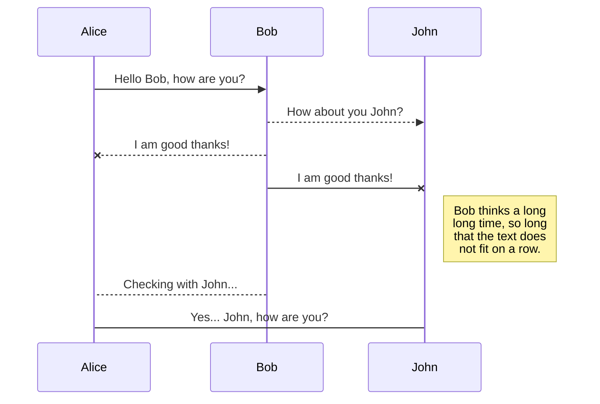

昨天特地安装了wiki.js，就是为了记笔记和分享笔记方便一些。

# 1 SpringBoot整合Mybatis完成表单CRUD 

## 1.1 REST风格
强调以资源为中心，在URL中部出现动词；通过post、put、get、delete请求来区分是保存、修改、查询、删除操作。

## 1.2 @ResquestMapping子注解
`` @GetMapping`` GET请求。同理其余请求。

``@RestController``


## 1.3 以访问Student数据为例的代码 

项目目录结构：


## TAB {.tabset}

### site/hailay/Application.java
```java
import org.springframework.boot.SpringApplication;
import org.springframework.boot.autoconfigure.SpringBootApplication;

@SpringBootApplication

public class Application {
    public static void main(String[] args) {
        SpringApplication.run(Application.class, args);
    }
}

```

### site/hailay/controller/StudentController.java
```java
@RestController // 声明当前类可以接受请求和生成响应，并且生成类对象放入SpringIOC中
public class StudentController {

    @Autowired
    private StudentService studentService;

    // get请求查询所有学生对象
    @GetMapping("students")
    public List<Student> findAll(){
        List<Student> list = studentService.findAll();
        return list;
    }

    // 处理get请求根据id查询单条记录，id是动态时用{}作为占位符
    @GetMapping("students/{sid}")
    // @PathVariable(value = "sid") 获取路径中大括号的参数，赋值给方法的形参
    // 如果sid和id的名称一致，则(value = "sid")可以省略
    public Student findById(@PathVariable(value = "sid") Long id){
        Student student = studentService.findById(id);
        return student;
    }
}

```

### site/hailay/mapper/StudentMapper.java
```java
@Mapper // 底层会创建该接口的代理对象，将其放入spring IOC 容器中
public interface StudentMapper {
    @Select("select * from tb_student where id = #{id}")
    Student findById(Long id);

    @Select("select * from tb_student")
    List<Student> findAll();

    @Insert("insert into tb_student values(null, #{number},#{userName}, #{birthday}, #{address})")
    // 返回新增记录的主键，设置给参数的id属性
    @Options(useGeneratedKeys = true, keyProperty = "id")
    void save(Student student);

    @Update("update tb_student set number=#{number}, user_name=#{userName}, birthday=#{birthday}, address=#{address} where id=#{id}")
    void updateById(Student student);

    @Delete("delete from tb_student where id=#{id}")
    void deleteById(Long id);

    // 条件查询，动态sql建议写在xml文件中
    List<Student> findByCondition(String username, String num);
}
```
### site/hailay/service/StudentService.java
```java
public interface StudentService {
    List<Student> findAll();

    Student findById(Long id);
}

```
### site/hailay/service/impl/StudentServiceImpl.java
```java
@Service // 在项目启动的时候创建该类的对象，放入Spring IOC中
public class StudentServiceImpl implements StudentService {

    @Autowired // 从容器中获取指定类型的对象，设置给当时的成员变量。
    private StudentMapper studentMapper;

    @Override
    public List<Student> findAll() {
        List<Student> list = studentMapper.findAll();
        return list;
    }

    @Override
    public Student findById(Long id) {
        return studentMapper.findById(id);
    }
}
```

### site/hailay/mapper/StudentMapper.xml
````xml
<?xml version="1.0" encoding="UTF-8"?>
<!DOCTYPE mapper
        PUBLIC "-//mybatis.org//DTD Mapper 3.0//EN"
        "http://mybatis.org/dtd/mybatis-3-mapper.dtd">

<mapper namespace="site.hailay.mapper.StudentMapper">


    <select id="findByCondition" resultType="site.hailay.pojo.Student">
        select * from tb_student
--         where标签会自动去掉多余的and / or 和条件满足则带where
        <where>
            <if test="username != null and username !='' ">
                and user_name like concat('%',#{username},'%')
            </if>
            <if test="num != null and num != '' ">
                and number = #{num}
            </if>
        </where>
    </select>
</mapper>
````

## 1.4 实现效果
http://localhost:9090/students

#### 获取全部


#### 获取单个用户


## 1.5 整体结构图
```diagram
PHN2ZyB4bWxucz0iaHR0cDovL3d3dy53My5vcmcvMjAwMC9zdmciIHhtbG5zOnhsaW5rPSJodHRwOi8vd3d3LnczLm9yZy8xOTk5L3hsaW5rIiB2ZXJzaW9uPSIxLjEiIHdpZHRoPSIxMDgwcHgiIGhlaWdodD0iNDc3cHgiIHZpZXdCb3g9Ii0wLjUgLTAuNSAxMDgwIDQ3NyIgY29udGVudD0iJmx0O214ZmlsZSBob3N0PSZxdW90O2VtYmVkLmRpYWdyYW1zLm5ldCZxdW90OyBtb2RpZmllZD0mcXVvdDsyMDIzLTA4LTMwVDAyOjI1OjAwLjc4MFomcXVvdDsgYWdlbnQ9JnF1b3Q7TW96aWxsYS81LjAgKFdpbmRvd3MgTlQgMTAuMDsgV2luNjQ7IHg2NCkgQXBwbGVXZWJLaXQvNTM3LjM2IChLSFRNTCwgbGlrZSBHZWNrbykgQ2hyb21lLzExNi4wLjAuMCBTYWZhcmkvNTM3LjM2IEVkZy8xMTYuMC4xOTM4LjYyJnF1b3Q7IHZlcnNpb249JnF1b3Q7MjEuNi45JnF1b3Q7IGV0YWc9JnF1b3Q7Z1hJejdmd1l5cXZ0c2xGMGpSNEwmcXVvdDsgdHlwZT0mcXVvdDtlbWJlZCZxdW90OyZndDsmbHQ7ZGlhZ3JhbSBpZD0mcXVvdDtNZGlaSzduV3pEZUVELW9uZ0hlOCZxdW90OyBuYW1lPSZxdW90O+esrCAxIOmhtSZxdW90OyZndDs3VnhiYzZ1MkZ2NHRmV0NtZlVnR3hFMDhtdGc1UFRPNzdaNUpaMDc3S0dQWjVteU0ySUNUdUwrK0VrZzJJR0dUR01zK1BzMUxqRzdBV3ArK2RXR0JZVDl0M3YrVm8yejlDMW5neEFEbTR0Mndwd1lBbHU4NTlCOXIyZFV0MExQcWhsVWVML2lnUThOTC9CZm1qU1p2M2NZTFhMUUdsb1FrWlp5MUd5T1NwamdxVzIwb3o4bGJlOWlTSk8yelptaUZwWWFYQ0NWeTYzL2lSYm5tZHdIOFEvdlBPRjZ0eFprdEw2aDdOa2dNNW5kU3JOR0N2RFdhN0psaFArV0VsUFd2emZzVFRwandoRnpxZWM4OXZmc0x5M0ZhRHBrQTZnbXZLTm55ZStQWFZlN0V6ZVprbXk0d0cyOFpkdmkyamt2OGtxR0k5YjVSOWRLMmRibEplUGN5VHBJbmtwQzhtbXN2bDBzUVJiUzlLSFB5RFRkNkZ0N2NjejNhd3k4QTV5Vis3NzBKYXk4YWlpbE1OcmpNZDNRSW4rRGFYSm9DVG01OStIYlFqZVB5dG5WREw0N0ZHeEhIdzJxLzlFRms5QWVYbWxxQzlrY2thSjZXNEFYa1libjJvNitRaVdQS01yRk43eEdNSUJibjBzRENYZyt3L0dCdW11TUkwdkt0dGlBdElFbHh2NVdiVWdTQmViNElYVWxpZUVGcGlCK1N2RnlURlVsUk1qdTBodEUyZjkyTHRJMjd3NFF2aEdSOHlIOXhXZTQ0d2FKdFNkcEN4Kzl4K1FlZnpuNy8yV2lmdmpjNnBqdHhrTktiL0VNTVl3ZHNqc25neDQ4UDg2b2pNYkdqM3dYQ2NLblVyeGRCUEYvdTljdEVjbHk3VklKa20wZDhGS2ZvRXVVckxFYVphaERrT0VGbC9OcGVYcVhRYXVva3o5R3VNU0FqY1ZvV2paVy9zb2IrVFFwZ2g2azc0eDN6elBIYzZCN0FWMS94QVlyN1d4K0VUdThFelowQk42c0JOL1BSSFFZNHN3MjRrM2dqYWZtTU5uRlNpV2ZtR25CcXdKa3g4NHpBTTZCdnpCd2poTWFrNnByTURCanlPZnppTGFkYWNURmgzZ1E5amhKVUZISDArenBPNjQ3bk9EbVh1a2FBdHR2RGI0T2hQWlNyZkludUExTnc0R2NwL3dLV2tQb0JFb0hiS3Y0ZXdRTENUOUQzLzlRV2F0bWF6MEZXT1BSTnpQclhZR003NkFERlBjNnVyblh1ZURncUd3ZEh3WmFTZEZSMG5lOFBnRnZ4QjFRSXRGMU5yQ2xPM3FCTkM5aVdjM1hldE4zVHZLbUtIc2JnVGN1U2hKTGo3MXRjbEpKWTZBMlc3WHR2dzRQanZva2wzb1NTZUpVeXUwMEZnbWw3eU1RVjB3aC93anMyOFdKUlViSksyTzJOTklLOG5hNmRFa0ZGUTk2ZU1sb2JRZDV5RHVCM3NvblFIWXRiY2d0OGplSzI5VkwxM3ZoL2dLeWIvUHhuaTU3VlpQMUo2blZrNmowN0ZodXNCamxCTWYzMTVlckVDN3JFSy9NdXZCUXdqK2NieGdabTIwTzFPMy9IY1VvUHZ1SThwcmZJeU9Tb0UzdmEwVGd2RUFSbk9MK2V3dlhRRmJDSmt6Y1RkRFBmQ0J4akF0bk5RMmlFdmdTSVlvMHk5bk83U1NaUlNacE0vZ1hOY2ZLVkZIRVpFOGJvYzFLV1pLT2crcEowdGczWmxrbWNVaXNpa3ZVanNUdzRiVk5Wc1o4M3hsNlM0K0VYbkw4bVZNM0FTNWdSbmVmMDE0cjlxcVE5TXladUJiNW5JNkNZbzRCN1p2S25YYUZsUUtDYVJlSG9HTkNwdEdZYTBCczJxMUp4OE14VlRDY3FaaDNONjV6Z1FHSHBFN3dzUnpMV1RsdVBGbFJtcy8xTHFmSjRISDlOZTMySE9TeWdDTWNjV3hjblhpK0tObzhxdXVHWUJXM1A3TUY4TkczL2hJbXJqcm9HODNyZ3VWZ3Nyd1FQMUFRZUlNZnlnbjhYOFdzTFZkNzNMWHUrRzdKNDZvRVQ1b1NPMkhPbUdMQ25iYjVRa2FGVXVkSWNSZDlXRlRBZm9scWNiTDA0cGNZWUpjb2xDMnFPWWlvNHZqSzl1M3J4OWdscGMzWHhvdlVjNzdpTEFoZkRoYU5DQVFSejJ4dnAwYkFmZ0VlMzdRYkFmVXZEZXFnZUQ0TVJyQWVRa3hrcXkxM3R0V0JTYmNPSk1iR01HVFhKVHdaOHFycXEzY2RtZWN3OHkxNGEyN09WRmFkajZJSjBHQnM4WlkyczVZa052dHRZM3ZjNytyVmw3UVlYQ3BuQUtXZnB4alA0YXNPZ3k5UXJ3bitnamEwMVoyRStub05wSmN5dEU0cThSMk91Z0ljMlQxQlp2aktTTWQrZ0xNTzVCZ3U3aEJGVzc5dzVkQjEzSlA2RmNKQjlWVDBzR0lPQjNVL2ExOENBcGhHR0xQeWw5ald3Sk1uZmo0R0Vmc2NGc2oxOTZXNmd5ak5ScHdSVXpnM2xKOWNJemNxVm1USm1vbDNoeEFqc1NpL1BSbEFwaU9xTGUwSVRwdG42UnlEYjNydFJHZlRONnlsTXp2cGRQd2gyd2Q0RDZrMzgzbXJGbVNnRWFmazVqaTVEQmhYYnIzL1g5ZVY3bzEwU1UzM245bWtqTksrUjhXVytiOWpIcHIvVmlWNnhON252NGNxNndCYU5EbjJWTGdMUHQ5RklzYUZsMmtIYmRIbSt3blNwTmhvY1k2TUZrbXB5WEdTa3dQZExiTkp6YnFpUDJNUWFGdy9XanZyM24rTVFXN3psMEh4VXFvdERiRG1Ic1VaeGduYVBCWVhNRWFIcWVXUnErZDNuUE1QMjhCaTFLamFRUlBQdnIvU1k1MTNDK3NmVWdETDI1RDA5Zks5U25vai9Rdk5xS1FZcVh0MUcxM1ZEdzUyeXRTaFVCY0YrZ0M1R1VJZHR0bXZtUFUvZkRwZmZ4ZGpzNW5RekZEOW15YmI0Nlg1NUZYYVNZTFpPWHBYTDFiUTVqQ2Z5WXJwY1BKRnliTkd6cDR1ZVZTR3d4d0xlc1BiMW5xdDR5amZDS1l0emFlUkw0NmxRTHZiUXp0dmRrdHRncVBjbGtuZG5TVTBWbDNxTXRPRzBrU2FnN0IzY2J2cDh2TnFWOHpJTUp1eGtHQUtaOUFPb29KOWdCRVhLcFJZVi9LdGFDcFk4OE5sVGtuOFVPVVNSMUc2MDFHaDV0ajQ5eXBIcVpsZDhUK1FpRnRzMjVaZVBia09QWTlDaUthaEoySEpYb3kyWFkxSWhmd2EzbHNoRlhwdDFQTlMrSnN0N1cwNzJiclR6M3VZU1JlMDVneUF1WmM1ZnNqeE9WM1AyY3ZRaGUxNWZWMC82L0c1UTRYYU1aYzhydlpmQ2hTakJhc1k1dnoxeFZZVkJQNzErcUhac2pLZFlvNWl6anF3VkxLaXFOblBHRUxUOElFSmZFZTduSGpLZlRyVGVYNW1hd3hGeGxaeXVBN1JpUk5SUWY3UlNyVjJvOW4vNEJGc0pFbDN2TnppcTcxTDhVNDUyOVhLMFRwNEdtQm9mbGp2OVZRMjlxbXpvTDEvTmY2UlhRVTlqaW44L2NmK091WUJMdm52WjBKOXg4b3FadTlUb2I3aUlnTHVJdktNK0tldEpTYjdoQ0tuN1hsRWVJL3Fmb2hLVjI1eDk5T2ZvdUFobGZVUGV1RFJacDhPNW4ySzhwTzdkQTczOWlMcVc4a3lTWjJ1VThpVkIzZGE3VCtvZTlxQXM1ZWN4eFkxV1BXVk9sMXJTMWNWNWVNNlY2Yjc2SmxIakpHOGtYN1F2YTc4V3ZaUDV0NWd1eDlhczRmckEwZE1hcDk2RlRJdFZWU3hUSUhBQy9zTVZ1cXhXWGVDSTVJaTl5ZkZRcnVQb1c0cUxRdDdFMHRpR0pvK082eUVGYzVrUVZIYUZzNGlMTEVFN01ieDZnZ2pNSCtKTlJvMGFTdFVVRlRPdnZRbzcraGhGSFNrTThGQ2JGdWN6Vm1zTUdySGxxbFo5UWFJakp4eXBNcEliRGI1dUpham92TmluWm43bE85VmpxRXhPbU9nTEs4REF1T0xEbndpNHc3aENVU3ZpYUlzcnJsajVNeGdrNW1OZytXMmdCSjhyYzc3RGdFT0JIbTFmQUhJVWxVWTNISEJFVkpVNVNaSldKYTd1bUdNb0VNNnlQRjYzUGtMckN6Q08zbmZxUHBMUXVrUDc0U3JxaExTOUFlZktSUzYzL0U3RlRXY3VMMllqVkFnNTk0dGJnd0dpZUJudWhrM0VKTXNTR25SVTN6TzRtbzNROUFYZG5zK2Z0Y0xKY1N3RVBUeDgzcmorMHRuaEk5SDI3Rzg9Jmx0Oy9kaWFncmFtJmd0OyZsdDsvbXhmaWxlJmd0OyI+PGRlZnMvPjxnPjxyZWN0IHg9IjUxMCIgeT0iNjAiIHdpZHRoPSI0NTUiIGhlaWdodD0iNDE1IiByeD0iNjIuMjUiIHJ5PSI2Mi4yNSIgZmlsbD0iI2ZmZjJjYyIgc3Ryb2tlPSIjZDZiNjU2IiBwb2ludGVyLWV2ZW50cz0iYWxsIi8+PHJlY3QgeD0iNTEwIiB5PSIxMjguNzUiIHdpZHRoPSI0NDAiIGhlaWdodD0iMzA2LjI1IiBmaWxsPSJyZ2IoMjU1LCAyNTUsIDI1NSkiIHN0cm9rZT0icmdiKDAsIDAsIDApIiBwb2ludGVyLWV2ZW50cz0iYWxsIi8+PHJlY3QgeD0iMTUxIiB5PSI4NyIgd2lkdGg9IjIyMCIgaGVpZ2h0PSIyOTAiIHJ4PSIzMyIgcnk9IjMzIiBmaWxsPSIjZmZlNmNjIiBzdHJva2U9IiNkNzliMDAiIHBvaW50ZXItZXZlbnRzPSJhbGwiLz48cGF0aCBkPSJNIDUxMCAyNDUgUSA1MTAgMjU1IDQ0NSAyNTUgUSAzODAgMjU1IDM4MCAyNDYuOTMgUSAzODAgMjM4Ljg2IDM3Ni4zNyAyMzguODIiIGZpbGw9Im5vbmUiIHN0cm9rZT0iIzZjOGViZiIgc3Ryb2tlLW1pdGVybGltaXQ9IjEwIiBwb2ludGVyLWV2ZW50cz0ic3Ryb2tlIi8+PHBhdGggZD0iTSAzNzEuMTIgMjM4Ljc2IEwgMzc4LjE2IDIzNS4zNCBMIDM3Ni4zNyAyMzguODIgTCAzNzguMDggMjQyLjM0IFoiIGZpbGw9IiM2YzhlYmYiIHN0cm9rZT0iIzZjOGViZiIgc3Ryb2tlLW1pdGVybGltaXQ9IjEwIiBwb2ludGVyLWV2ZW50cz0iYWxsIi8+PHBhdGggZD0iTSA1NDAgMjMyLjUgTCA1NjMuNjUgMjM0LjQ3IiBmaWxsPSJub25lIiBzdHJva2U9IiNkNzliMDAiIHN0cm9rZS1taXRlcmxpbWl0PSIxMCIgcG9pbnRlci1ldmVudHM9InN0cm9rZSIvPjxwYXRoIGQ9Ik0gNTY4Ljg5IDIzNC45MSBMIDU2MS43MiAyMzYuNjUgTCA1NjMuNjUgMjM0LjQ3IEwgNTYyLjEgMjMyIFoiIGZpbGw9IiNkNzliMDAiIHN0cm9rZT0iI2Q3OWIwMCIgc3Ryb2tlLW1pdGVybGltaXQ9IjEwIiBwb2ludGVyLWV2ZW50cz0iYWxsIi8+PHJlY3QgeD0iNTEwIiB5PSIyMjAiIHdpZHRoPSIzMCIgaGVpZ2h0PSIyNSIgcng9IjMuNzUiIHJ5PSIzLjc1IiBmaWxsPSJyZ2IoMjU1LCAyNTUsIDI1NSkiIHN0cm9rZT0icmdiKDAsIDAsIDApIiBwb2ludGVyLWV2ZW50cz0iYWxsIi8+PGcgdHJhbnNmb3JtPSJ0cmFuc2xhdGUoLTAuNSAtMC41KSI+PHN3aXRjaD48Zm9yZWlnbk9iamVjdCBwb2ludGVyLWV2ZW50cz0ibm9uZSIgd2lkdGg9IjEwMCUiIGhlaWdodD0iMTAwJSIgcmVxdWlyZWRGZWF0dXJlcz0iaHR0cDovL3d3dy53My5vcmcvVFIvU1ZHMTEvZmVhdHVyZSNFeHRlbnNpYmlsaXR5IiBzdHlsZT0ib3ZlcmZsb3c6IHZpc2libGU7IHRleHQtYWxpZ246IGxlZnQ7Ij48ZGl2IHhtbG5zPSJodHRwOi8vd3d3LnczLm9yZy8xOTk5L3hodG1sIiBzdHlsZT0iZGlzcGxheTogZmxleDsgYWxpZ24taXRlbXM6IHVuc2FmZSBjZW50ZXI7IGp1c3RpZnktY29udGVudDogdW5zYWZlIGNlbnRlcjsgd2lkdGg6IDI4cHg7IGhlaWdodDogMXB4OyBwYWRkaW5nLXRvcDogMjMzcHg7IG1hcmdpbi1sZWZ0OiA1MTFweDsiPjxkaXYgZGF0YS1kcmF3aW8tY29sb3JzPSJjb2xvcjogcmdiKDAsIDAsIDApOyAiIHN0eWxlPSJib3gtc2l6aW5nOiBib3JkZXItYm94OyBmb250LXNpemU6IDBweDsgdGV4dC1hbGlnbjogY2VudGVyOyI+PGRpdiBzdHlsZT0iZGlzcGxheTogaW5saW5lLWJsb2NrOyBmb250LXNpemU6IDEycHg7IGZvbnQtZmFtaWx5OiBIZWx2ZXRpY2E7IGNvbG9yOiByZ2IoMCwgMCwgMCk7IGxpbmUtaGVpZ2h0OiAxLjI7IHBvaW50ZXItZXZlbnRzOiBhbGw7IHdoaXRlLXNwYWNlOiBub3JtYWw7IG92ZXJmbG93LXdyYXA6IG5vcm1hbDsiPjkwOTA8L2Rpdj48L2Rpdj48L2Rpdj48L2ZvcmVpZ25PYmplY3Q+PHRleHQgeD0iNTI1IiB5PSIyMzYiIGZpbGw9InJnYigwLCAwLCAwKSIgZm9udC1mYW1pbHk9IkhlbHZldGljYSIgZm9udC1zaXplPSIxMnB4IiB0ZXh0LWFuY2hvcj0ibWlkZGxlIj45MDkwPC90ZXh0Pjwvc3dpdGNoPjwvZz48cGF0aCBkPSJNIDM3MCAyMzIuNSBRIDM3MCAyMjUgNDMwIDIyNSBRIDQ5MCAyMjUgNDkwIDIyOC43MSBRIDQ5MCAyMzIuNDMgNTAzLjYzIDIzMi40OCIgZmlsbD0ibm9uZSIgc3Ryb2tlPSJyZ2IoMCwgMCwgMCkiIHN0cm9rZS1taXRlcmxpbWl0PSIxMCIgcG9pbnRlci1ldmVudHM9InN0cm9rZSIvPjxwYXRoIGQ9Ik0gNTA4Ljg4IDIzMi41IEwgNTAxLjg3IDIzNS45NyBMIDUwMy42MyAyMzIuNDggTCA1MDEuODkgMjI4Ljk3IFoiIGZpbGw9InJnYigwLCAwLCAwKSIgc3Ryb2tlPSJyZ2IoMCwgMCwgMCkiIHN0cm9rZS1taXRlcmxpbWl0PSIxMCIgcG9pbnRlci1ldmVudHM9ImFsbCIvPjxwYXRoIGQ9Ik0gMzMwIDI0NSBMIDIzNi4wNCAyNzYuMjQiIGZpbGw9Im5vbmUiIHN0cm9rZT0iIzZjOGViZiIgc3Ryb2tlLW1pdGVybGltaXQ9IjEwIiBwb2ludGVyLWV2ZW50cz0ic3Ryb2tlIi8+PHBhdGggZD0iTSAyMzEuMDYgMjc3LjkgTCAyMzYuNiAyNzIuMzcgTCAyMzYuMDQgMjc2LjI0IEwgMjM4LjgxIDI3OS4wMSBaIiBmaWxsPSIjNmM4ZWJmIiBzdHJva2U9IiM2YzhlYmYiIHN0cm9rZS1taXRlcmxpbWl0PSIxMCIgcG9pbnRlci1ldmVudHM9ImFsbCIvPjxyZWN0IHg9IjMzMCIgeT0iMjIwIiB3aWR0aD0iNDAiIGhlaWdodD0iMjUiIHJ4PSIzLjc1IiByeT0iMy43NSIgZmlsbD0icmdiKDI1NSwgMjU1LCAyNTUpIiBzdHJva2U9InJnYigwLCAwLCAwKSIgcG9pbnRlci1ldmVudHM9ImFsbCIvPjxnIHRyYW5zZm9ybT0idHJhbnNsYXRlKC0wLjUgLTAuNSkiPjxzd2l0Y2g+PGZvcmVpZ25PYmplY3QgcG9pbnRlci1ldmVudHM9Im5vbmUiIHdpZHRoPSIxMDAlIiBoZWlnaHQ9IjEwMCUiIHJlcXVpcmVkRmVhdHVyZXM9Imh0dHA6Ly93d3cudzMub3JnL1RSL1NWRzExL2ZlYXR1cmUjRXh0ZW5zaWJpbGl0eSIgc3R5bGU9Im92ZXJmbG93OiB2aXNpYmxlOyB0ZXh0LWFsaWduOiBsZWZ0OyI+PGRpdiB4bWxucz0iaHR0cDovL3d3dy53My5vcmcvMTk5OS94aHRtbCIgc3R5bGU9ImRpc3BsYXk6IGZsZXg7IGFsaWduLWl0ZW1zOiB1bnNhZmUgY2VudGVyOyBqdXN0aWZ5LWNvbnRlbnQ6IHVuc2FmZSBjZW50ZXI7IHdpZHRoOiAzOHB4OyBoZWlnaHQ6IDFweDsgcGFkZGluZy10b3A6IDIzM3B4OyBtYXJnaW4tbGVmdDogMzMxcHg7Ij48ZGl2IGRhdGEtZHJhd2lvLWNvbG9ycz0iY29sb3I6IHJnYigwLCAwLCAwKTsgIiBzdHlsZT0iYm94LXNpemluZzogYm9yZGVyLWJveDsgZm9udC1zaXplOiAwcHg7IHRleHQtYWxpZ246IGNlbnRlcjsiPjxkaXYgc3R5bGU9ImRpc3BsYXk6IGlubGluZS1ibG9jazsgZm9udC1zaXplOiAxMnB4OyBmb250LWZhbWlseTogSGVsdmV0aWNhOyBjb2xvcjogcmdiKDAsIDAsIDApOyBsaW5lLWhlaWdodDogMS4yOyBwb2ludGVyLWV2ZW50czogYWxsOyB3aGl0ZS1zcGFjZTogbm9ybWFsOyBvdmVyZmxvdy13cmFwOiBub3JtYWw7Ij4xMjMxNDwvZGl2PjwvZGl2PjwvZGl2PjwvZm9yZWlnbk9iamVjdD48dGV4dCB4PSIzNTAiIHk9IjIzNiIgZmlsbD0icmdiKDAsIDAsIDApIiBmb250LWZhbWlseT0iSGVsdmV0aWNhIiBmb250LXNpemU9IjEycHgiIHRleHQtYW5jaG9yPSJtaWRkbGUiPjEyMzE0PC90ZXh0Pjwvc3dpdGNoPjwvZz48cmVjdCB4PSI0MTAiIHk9IjE5NSIgd2lkdGg9IjYwIiBoZWlnaHQ9IjMwIiBmaWxsPSJub25lIiBzdHJva2U9Im5vbmUiIHBvaW50ZXItZXZlbnRzPSJhbGwiLz48ZyB0cmFuc2Zvcm09InRyYW5zbGF0ZSgtMC41IC0wLjUpIj48c3dpdGNoPjxmb3JlaWduT2JqZWN0IHBvaW50ZXItZXZlbnRzPSJub25lIiB3aWR0aD0iMTAwJSIgaGVpZ2h0PSIxMDAlIiByZXF1aXJlZEZlYXR1cmVzPSJodHRwOi8vd3d3LnczLm9yZy9UUi9TVkcxMS9mZWF0dXJlI0V4dGVuc2liaWxpdHkiIHN0eWxlPSJvdmVyZmxvdzogdmlzaWJsZTsgdGV4dC1hbGlnbjogbGVmdDsiPjxkaXYgeG1sbnM9Imh0dHA6Ly93d3cudzMub3JnLzE5OTkveGh0bWwiIHN0eWxlPSJkaXNwbGF5OiBmbGV4OyBhbGlnbi1pdGVtczogdW5zYWZlIGNlbnRlcjsganVzdGlmeS1jb250ZW50OiB1bnNhZmUgY2VudGVyOyB3aWR0aDogNThweDsgaGVpZ2h0OiAxcHg7IHBhZGRpbmctdG9wOiAyMTBweDsgbWFyZ2luLWxlZnQ6IDQxMXB4OyI+PGRpdiBkYXRhLWRyYXdpby1jb2xvcnM9ImNvbG9yOiByZ2IoMCwgMCwgMCk7ICIgc3R5bGU9ImJveC1zaXppbmc6IGJvcmRlci1ib3g7IGZvbnQtc2l6ZTogMHB4OyB0ZXh0LWFsaWduOiBjZW50ZXI7Ij48ZGl2IHN0eWxlPSJkaXNwbGF5OiBpbmxpbmUtYmxvY2s7IGZvbnQtc2l6ZTogMTJweDsgZm9udC1mYW1pbHk6IEhlbHZldGljYTsgY29sb3I6IHJnYigwLCAwLCAwKTsgbGluZS1oZWlnaHQ6IDEuMjsgcG9pbnRlci1ldmVudHM6IGFsbDsgd2hpdGUtc3BhY2U6IG5vcm1hbDsgb3ZlcmZsb3ctd3JhcDogbm9ybWFsOyI+cmVxdWVzdDwvZGl2PjwvZGl2PjwvZGl2PjwvZm9yZWlnbk9iamVjdD48dGV4dCB4PSI0NDAiIHk9IjIxNCIgZmlsbD0icmdiKDAsIDAsIDApIiBmb250LWZhbWlseT0iSGVsdmV0aWNhIiBmb250LXNpemU9IjEycHgiIHRleHQtYW5jaG9yPSJtaWRkbGUiPnJlcXVlc3Q8L3RleHQ+PC9zd2l0Y2g+PC9nPjxyZWN0IHg9IjUxMCIgeT0iMjQ1IiB3aWR0aD0iNjAiIGhlaWdodD0iMzAiIGZpbGw9Im5vbmUiIHN0cm9rZT0ibm9uZSIgcG9pbnRlci1ldmVudHM9ImFsbCIvPjxnIHRyYW5zZm9ybT0idHJhbnNsYXRlKC0wLjUgLTAuNSkiPjxzd2l0Y2g+PGZvcmVpZ25PYmplY3QgcG9pbnRlci1ldmVudHM9Im5vbmUiIHdpZHRoPSIxMDAlIiBoZWlnaHQ9IjEwMCUiIHJlcXVpcmVkRmVhdHVyZXM9Imh0dHA6Ly93d3cudzMub3JnL1RSL1NWRzExL2ZlYXR1cmUjRXh0ZW5zaWJpbGl0eSIgc3R5bGU9Im92ZXJmbG93OiB2aXNpYmxlOyB0ZXh0LWFsaWduOiBsZWZ0OyI+PGRpdiB4bWxucz0iaHR0cDovL3d3dy53My5vcmcvMTk5OS94aHRtbCIgc3R5bGU9ImRpc3BsYXk6IGZsZXg7IGFsaWduLWl0ZW1zOiB1bnNhZmUgY2VudGVyOyBqdXN0aWZ5LWNvbnRlbnQ6IHVuc2FmZSBjZW50ZXI7IHdpZHRoOiA1OHB4OyBoZWlnaHQ6IDFweDsgcGFkZGluZy10b3A6IDI2MHB4OyBtYXJnaW4tbGVmdDogNTExcHg7Ij48ZGl2IGRhdGEtZHJhd2lvLWNvbG9ycz0iY29sb3I6IHJnYigwLCAwLCAwKTsgIiBzdHlsZT0iYm94LXNpemluZzogYm9yZGVyLWJveDsgZm9udC1zaXplOiAwcHg7IHRleHQtYWxpZ246IGNlbnRlcjsiPjxkaXYgc3R5bGU9ImRpc3BsYXk6IGlubGluZS1ibG9jazsgZm9udC1zaXplOiAxMnB4OyBmb250LWZhbWlseTogSGVsdmV0aWNhOyBjb2xvcjogcmdiKDAsIDAsIDApOyBsaW5lLWhlaWdodDogMS4yOyBwb2ludGVyLWV2ZW50czogYWxsOyB3aGl0ZS1zcGFjZTogbm9ybWFsOyBvdmVyZmxvdy13cmFwOiBub3JtYWw7Ij5Ub21jYXQ8L2Rpdj48L2Rpdj48L2Rpdj48L2ZvcmVpZ25PYmplY3Q+PHRleHQgeD0iNTQwIiB5PSIyNjQiIGZpbGw9InJnYigwLCAwLCAwKSIgZm9udC1mYW1pbHk9IkhlbHZldGljYSIgZm9udC1zaXplPSIxMnB4IiB0ZXh0LWFuY2hvcj0ibWlkZGxlIj5Ub21jYXQ8L3RleHQ+PC9zd2l0Y2g+PC9nPjxwYXRoIGQ9Ik0gMjcwIDMwIEwgMzM3LjggMjE0LjAyIiBmaWxsPSJub25lIiBzdHJva2U9InJnYigwLCAwLCAwKSIgc3Ryb2tlLW1pdGVybGltaXQ9IjEwIiBwb2ludGVyLWV2ZW50cz0ic3Ryb2tlIi8+PHBhdGggZD0iTSAzMzkuNjEgMjE4Ljk1IEwgMzMzLjkxIDIxMy41OSBMIDMzNy44IDIxNC4wMiBMIDM0MC40OCAyMTEuMTcgWiIgZmlsbD0icmdiKDAsIDAsIDApIiBzdHJva2U9InJnYigwLCAwLCAwKSIgc3Ryb2tlLW1pdGVybGltaXQ9IjEwIiBwb2ludGVyLWV2ZW50cz0iYWxsIi8+PHJlY3QgeD0iMjMwIiB5PSIwIiB3aWR0aD0iODAiIGhlaWdodD0iMzAiIHJ4PSI0LjUiIHJ5PSI0LjUiIGZpbGw9InJnYigyNTUsIDI1NSwgMjU1KSIgc3Ryb2tlPSJyZ2IoMCwgMCwgMCkiIHBvaW50ZXItZXZlbnRzPSJhbGwiLz48ZyB0cmFuc2Zvcm09InRyYW5zbGF0ZSgtMC41IC0wLjUpIj48c3dpdGNoPjxmb3JlaWduT2JqZWN0IHBvaW50ZXItZXZlbnRzPSJub25lIiB3aWR0aD0iMTAwJSIgaGVpZ2h0PSIxMDAlIiByZXF1aXJlZEZlYXR1cmVzPSJodHRwOi8vd3d3LnczLm9yZy9UUi9TVkcxMS9mZWF0dXJlI0V4dGVuc2liaWxpdHkiIHN0eWxlPSJvdmVyZmxvdzogdmlzaWJsZTsgdGV4dC1hbGlnbjogbGVmdDsiPjxkaXYgeG1sbnM9Imh0dHA6Ly93d3cudzMub3JnLzE5OTkveGh0bWwiIHN0eWxlPSJkaXNwbGF5OiBmbGV4OyBhbGlnbi1pdGVtczogdW5zYWZlIGNlbnRlcjsganVzdGlmeS1jb250ZW50OiB1bnNhZmUgY2VudGVyOyB3aWR0aDogNzhweDsgaGVpZ2h0OiAxcHg7IHBhZGRpbmctdG9wOiAxNXB4OyBtYXJnaW4tbGVmdDogMjMxcHg7Ij48ZGl2IGRhdGEtZHJhd2lvLWNvbG9ycz0iY29sb3I6IHJnYigwLCAwLCAwKTsgIiBzdHlsZT0iYm94LXNpemluZzogYm9yZGVyLWJveDsgZm9udC1zaXplOiAwcHg7IHRleHQtYWxpZ246IGNlbnRlcjsiPjxkaXYgc3R5bGU9ImRpc3BsYXk6IGlubGluZS1ibG9jazsgZm9udC1zaXplOiAxMnB4OyBmb250LWZhbWlseTogSGVsdmV0aWNhOyBjb2xvcjogcmdiKDAsIDAsIDApOyBsaW5lLWhlaWdodDogMS4yOyBwb2ludGVyLWV2ZW50czogYWxsOyB3aGl0ZS1zcGFjZTogbm9ybWFsOyBvdmVyZmxvdy13cmFwOiBub3JtYWw7Ij5ETlM8L2Rpdj48L2Rpdj48L2Rpdj48L2ZvcmVpZ25PYmplY3Q+PHRleHQgeD0iMjcwIiB5PSIxOSIgZmlsbD0icmdiKDAsIDAsIDApIiBmb250LWZhbWlseT0iSGVsdmV0aWNhIiBmb250LXNpemU9IjEycHgiIHRleHQtYW5jaG9yPSJtaWRkbGUiPkROUzwvdGV4dD48L3N3aXRjaD48L2c+PHBhdGggZD0iTSAzMCAyMTUgTCAxNDMuNjUgMjA2LjcxIiBmaWxsPSJub25lIiBzdHJva2U9InJnYigwLCAwLCAwKSIgc3Ryb2tlLW1pdGVybGltaXQ9IjEwIiBwb2ludGVyLWV2ZW50cz0ic3Ryb2tlIi8+PHBhdGggZD0iTSAxNDguODggMjA2LjMzIEwgMTQyLjE2IDIxMC4zMyBMIDE0My42NSAyMDYuNzEgTCAxNDEuNjUgMjAzLjM1IFoiIGZpbGw9InJnYigwLCAwLCAwKSIgc3Ryb2tlPSJyZ2IoMCwgMCwgMCkiIHN0cm9rZS1taXRlcmxpbWl0PSIxMCIgcG9pbnRlci1ldmVudHM9ImFsbCIvPjxlbGxpcHNlIGN4PSIxNSIgY3k9IjIwMi41IiByeD0iNy41MDAwMDAwMDAwMDAwMDEiIHJ5PSI3LjUwMDAwMDAwMDAwMDAwMSIgZmlsbD0icmdiKDI1NSwgMjU1LCAyNTUpIiBzdHJva2U9InJnYigwLCAwLCAwKSIgcG9pbnRlci1ldmVudHM9ImFsbCIvPjxwYXRoIGQ9Ik0gMTUgMjEwIEwgMTUgMjM1IE0gMTUgMjE1IEwgMCAyMTUgTSAxNSAyMTUgTCAzMCAyMTUgTSAxNSAyMzUgTCAwIDI1NSBNIDE1IDIzNSBMIDMwIDI1NSIgZmlsbD0ibm9uZSIgc3Ryb2tlPSJyZ2IoMCwgMCwgMCkiIHN0cm9rZS1taXRlcmxpbWl0PSIxMCIgcG9pbnRlci1ldmVudHM9ImFsbCIvPjxnIHRyYW5zZm9ybT0idHJhbnNsYXRlKC0wLjUgLTAuNSkiPjxzd2l0Y2g+PGZvcmVpZ25PYmplY3QgcG9pbnRlci1ldmVudHM9Im5vbmUiIHdpZHRoPSIxMDAlIiBoZWlnaHQ9IjEwMCUiIHJlcXVpcmVkRmVhdHVyZXM9Imh0dHA6Ly93d3cudzMub3JnL1RSL1NWRzExL2ZlYXR1cmUjRXh0ZW5zaWJpbGl0eSIgc3R5bGU9Im92ZXJmbG93OiB2aXNpYmxlOyB0ZXh0LWFsaWduOiBsZWZ0OyI+PGRpdiB4bWxucz0iaHR0cDovL3d3dy53My5vcmcvMTk5OS94aHRtbCIgc3R5bGU9ImRpc3BsYXk6IGZsZXg7IGFsaWduLWl0ZW1zOiB1bnNhZmUgZmxleC1zdGFydDsganVzdGlmeS1jb250ZW50OiB1bnNhZmUgY2VudGVyOyB3aWR0aDogMXB4OyBoZWlnaHQ6IDFweDsgcGFkZGluZy10b3A6IDI2MnB4OyBtYXJnaW4tbGVmdDogMTVweDsiPjxkaXYgZGF0YS1kcmF3aW8tY29sb3JzPSJjb2xvcjogcmdiKDAsIDAsIDApOyAiIHN0eWxlPSJib3gtc2l6aW5nOiBib3JkZXItYm94OyBmb250LXNpemU6IDBweDsgdGV4dC1hbGlnbjogY2VudGVyOyI+PGRpdiBzdHlsZT0iZGlzcGxheTogaW5saW5lLWJsb2NrOyBmb250LXNpemU6IDEycHg7IGZvbnQtZmFtaWx5OiBIZWx2ZXRpY2E7IGNvbG9yOiByZ2IoMCwgMCwgMCk7IGxpbmUtaGVpZ2h0OiAxLjI7IHBvaW50ZXItZXZlbnRzOiBhbGw7IHdoaXRlLXNwYWNlOiBub3dyYXA7Ij7nlKjmiLc8L2Rpdj48L2Rpdj48L2Rpdj48L2ZvcmVpZ25PYmplY3Q+PHRleHQgeD0iMTUiIHk9IjI3NCIgZmlsbD0icmdiKDAsIDAsIDApIiBmb250LWZhbWlseT0iSGVsdmV0aWNhIiBmb250LXNpemU9IjEycHgiIHRleHQtYW5jaG9yPSJtaWRkbGUiPueUqOaItzwvdGV4dD48L3N3aXRjaD48L2c+PHJlY3QgeD0iNTIwIiB5PSIxNTguNzUiIHdpZHRoPSI3MCIgaGVpZ2h0PSI2MCIgZmlsbD0icmdiKDI1NSwgMjU1LCAyNTUpIiBzdHJva2U9InJnYigwLCAwLCAwKSIgcG9pbnRlci1ldmVudHM9ImFsbCIvPjxnIHRyYW5zZm9ybT0idHJhbnNsYXRlKC0wLjUgLTAuNSkiPjxzd2l0Y2g+PGZvcmVpZ25PYmplY3QgcG9pbnRlci1ldmVudHM9Im5vbmUiIHdpZHRoPSIxMDAlIiBoZWlnaHQ9IjEwMCUiIHJlcXVpcmVkRmVhdHVyZXM9Imh0dHA6Ly93d3cudzMub3JnL1RSL1NWRzExL2ZlYXR1cmUjRXh0ZW5zaWJpbGl0eSIgc3R5bGU9Im92ZXJmbG93OiB2aXNpYmxlOyB0ZXh0LWFsaWduOiBsZWZ0OyI+PGRpdiB4bWxucz0iaHR0cDovL3d3dy53My5vcmcvMTk5OS94aHRtbCIgc3R5bGU9ImRpc3BsYXk6IGZsZXg7IGFsaWduLWl0ZW1zOiB1bnNhZmUgY2VudGVyOyBqdXN0aWZ5LWNvbnRlbnQ6IHVuc2FmZSBmbGV4LXN0YXJ0OyB3aWR0aDogNjhweDsgaGVpZ2h0OiAxcHg7IHBhZGRpbmctdG9wOiAxODlweDsgbWFyZ2luLWxlZnQ6IDUyMnB4OyI+PGRpdiBkYXRhLWRyYXdpby1jb2xvcnM9ImNvbG9yOiByZ2IoMCwgMCwgMCk7ICIgc3R5bGU9ImJveC1zaXppbmc6IGJvcmRlci1ib3g7IGZvbnQtc2l6ZTogMHB4OyB0ZXh0LWFsaWduOiBsZWZ0OyI+PGRpdiBzdHlsZT0iZGlzcGxheTogaW5saW5lLWJsb2NrOyBmb250LXNpemU6IDEycHg7IGZvbnQtZmFtaWx5OiBIZWx2ZXRpY2E7IGNvbG9yOiByZ2IoMCwgMCwgMCk7IGxpbmUtaGVpZ2h0OiAxLjI7IHBvaW50ZXItZXZlbnRzOiBhbGw7IHdoaXRlLXNwYWNlOiBub3JtYWw7IG92ZXJmbG93LXdyYXA6IG5vcm1hbDsiPlNlcnZsZXQ8YnIgLz7mjqXlj5for7fmsYI8YnIgLz7lpITnkIbor7fmsYI8YnIgLz7nlJ/miJDor7fmsYI8L2Rpdj48L2Rpdj48L2Rpdj48L2ZvcmVpZ25PYmplY3Q+PHRleHQgeD0iNTIyIiB5PSIxOTIiIGZpbGw9InJnYigwLCAwLCAwKSIgZm9udC1mYW1pbHk9IkhlbHZldGljYSIgZm9udC1zaXplPSIxMnB4Ij5TZXJ2bGV0Li4uPC90ZXh0Pjwvc3dpdGNoPjwvZz48cGF0aCBkPSJNIDgwMCAyNzcuNSBMIDgwMCAyODkuMTMiIGZpbGw9Im5vbmUiIHN0cm9rZT0iI2Q3OWIwMCIgc3Ryb2tlLW1pdGVybGltaXQ9IjEwIiBwb2ludGVyLWV2ZW50cz0ic3Ryb2tlIi8+PHBhdGggZD0iTSA4MDAgMjk0LjM4IEwgNzk3LjY3IDI4Ny4zOCBMIDgwMCAyODkuMTMgTCA4MDIuMzMgMjg3LjM4IFoiIGZpbGw9IiNkNzliMDAiIHN0cm9rZT0iI2Q3OWIwMCIgc3Ryb2tlLW1pdGVybGltaXQ9IjEwIiBwb2ludGVyLWV2ZW50cz0iYWxsIi8+PHBhdGggZD0iTSA3NzIuNSAyNTcuNSBMIDcwNy4yNCAyNTYuODMiIGZpbGw9Im5vbmUiIHN0cm9rZT0iIzZjOGViZiIgc3Ryb2tlLW1pdGVybGltaXQ9IjEwIiBwb2ludGVyLWV2ZW50cz0ic3Ryb2tlIi8+PHBhdGggZD0iTSA3MDEuOTkgMjU2Ljc3IEwgNzA5LjAyIDI1NC41MSBMIDcwNy4yNCAyNTYuODMgTCA3MDguOTcgMjU5LjE4IFoiIGZpbGw9IiM2YzhlYmYiIHN0cm9rZT0iIzZjOGViZiIgc3Ryb2tlLW1pdGVybGltaXQ9IjEwIiBwb2ludGVyLWV2ZW50cz0iYWxsIi8+PHJlY3QgeD0iNzcyLjUiIHk9IjI1Ny41IiB3aWR0aD0iNTUiIGhlaWdodD0iMjAiIHJ4PSIzIiByeT0iMyIgZmlsbD0iI2Q1ZThkNCIgc3Ryb2tlPSIjODJiMzY2IiBwb2ludGVyLWV2ZW50cz0iYWxsIi8+PGcgdHJhbnNmb3JtPSJ0cmFuc2xhdGUoLTAuNSAtMC41KSI+PHN3aXRjaD48Zm9yZWlnbk9iamVjdCBwb2ludGVyLWV2ZW50cz0ibm9uZSIgd2lkdGg9IjEwMCUiIGhlaWdodD0iMTAwJSIgcmVxdWlyZWRGZWF0dXJlcz0iaHR0cDovL3d3dy53My5vcmcvVFIvU1ZHMTEvZmVhdHVyZSNFeHRlbnNpYmlsaXR5IiBzdHlsZT0ib3ZlcmZsb3c6IHZpc2libGU7IHRleHQtYWxpZ246IGxlZnQ7Ij48ZGl2IHhtbG5zPSJodHRwOi8vd3d3LnczLm9yZy8xOTk5L3hodG1sIiBzdHlsZT0iZGlzcGxheTogZmxleDsgYWxpZ24taXRlbXM6IHVuc2FmZSBjZW50ZXI7IGp1c3RpZnktY29udGVudDogdW5zYWZlIGNlbnRlcjsgd2lkdGg6IDUzcHg7IGhlaWdodDogMXB4OyBwYWRkaW5nLXRvcDogMjY4cHg7IG1hcmdpbi1sZWZ0OiA3NzRweDsiPjxkaXYgZGF0YS1kcmF3aW8tY29sb3JzPSJjb2xvcjogcmdiKDAsIDAsIDApOyAiIHN0eWxlPSJib3gtc2l6aW5nOiBib3JkZXItYm94OyBmb250LXNpemU6IDBweDsgdGV4dC1hbGlnbjogY2VudGVyOyI+PGRpdiBzdHlsZT0iZGlzcGxheTogaW5saW5lLWJsb2NrOyBmb250LXNpemU6IDEycHg7IGZvbnQtZmFtaWx5OiBIZWx2ZXRpY2E7IGNvbG9yOiByZ2IoMCwgMCwgMCk7IGxpbmUtaGVpZ2h0OiAxLjI7IHBvaW50ZXItZXZlbnRzOiBhbGw7IHdoaXRlLXNwYWNlOiBub3JtYWw7IG92ZXJmbG93LXdyYXA6IG5vcm1hbDsiPjxkaXYgc3R5bGU9InRleHQtYWxpZ246IGxlZnQ7Ij48c3BhbiBzdHlsZT0iYmFja2dyb3VuZC1jb2xvcjogaW5pdGlhbDsiPnNlcnZpY2U8L3NwYW4+PC9kaXY+PC9kaXY+PC9kaXY+PC9kaXY+PC9mb3JlaWduT2JqZWN0Pjx0ZXh0IHg9IjgwMCIgeT0iMjcxIiBmaWxsPSJyZ2IoMCwgMCwgMCkiIGZvbnQtZmFtaWx5PSJIZWx2ZXRpY2EiIGZvbnQtc2l6ZT0iMTJweCIgdGV4dC1hbmNob3I9Im1pZGRsZSI+c2VydmljZTwvdGV4dD48L3N3aXRjaD48L2c+PHJlY3QgeD0iNzU1IiB5PSIyMTAiIHdpZHRoPSI5MCIgaGVpZ2h0PSIzMCIgZmlsbD0ibm9uZSIgc3Ryb2tlPSJub25lIiBwb2ludGVyLWV2ZW50cz0iYWxsIi8+PGcgdHJhbnNmb3JtPSJ0cmFuc2xhdGUoLTAuNSAtMC41KSI+PHN3aXRjaD48Zm9yZWlnbk9iamVjdCBwb2ludGVyLWV2ZW50cz0ibm9uZSIgd2lkdGg9IjEwMCUiIGhlaWdodD0iMTAwJSIgcmVxdWlyZWRGZWF0dXJlcz0iaHR0cDovL3d3dy53My5vcmcvVFIvU1ZHMTEvZmVhdHVyZSNFeHRlbnNpYmlsaXR5IiBzdHlsZT0ib3ZlcmZsb3c6IHZpc2libGU7IHRleHQtYWxpZ246IGxlZnQ7Ij48ZGl2IHhtbG5zPSJodHRwOi8vd3d3LnczLm9yZy8xOTk5L3hodG1sIiBzdHlsZT0iZGlzcGxheTogZmxleDsgYWxpZ24taXRlbXM6IHVuc2FmZSBjZW50ZXI7IGp1c3RpZnktY29udGVudDogdW5zYWZlIGNlbnRlcjsgd2lkdGg6IDg4cHg7IGhlaWdodDogMXB4OyBwYWRkaW5nLXRvcDogMjI1cHg7IG1hcmdpbi1sZWZ0OiA3NTZweDsiPjxkaXYgZGF0YS1kcmF3aW8tY29sb3JzPSJjb2xvcjogcmdiKDAsIDAsIDApOyAiIHN0eWxlPSJib3gtc2l6aW5nOiBib3JkZXItYm94OyBmb250LXNpemU6IDBweDsgdGV4dC1hbGlnbjogY2VudGVyOyI+PGRpdiBzdHlsZT0iZGlzcGxheTogaW5saW5lLWJsb2NrOyBmb250LXNpemU6IDEycHg7IGZvbnQtZmFtaWx5OiBIZWx2ZXRpY2E7IGNvbG9yOiByZ2IoMCwgMCwgMCk7IGxpbmUtaGVpZ2h0OiAxLjI7IHBvaW50ZXItZXZlbnRzOiBhbGw7IHdoaXRlLXNwYWNlOiBub3JtYWw7IG92ZXJmbG93LXdyYXA6IG5vcm1hbDsiPuWkhOeQhuS4muWKoe+8jOS+i+WmgueUqOaIt+aYr+WQpuWtmOWcqDwvZGl2PjwvZGl2PjwvZGl2PjwvZm9yZWlnbk9iamVjdD48dGV4dCB4PSI4MDAiIHk9IjIyOSIgZmlsbD0icmdiKDAsIDAsIDApIiBmb250LWZhbWlseT0iSGVsdmV0aWNhIiBmb250LXNpemU9IjEycHgiIHRleHQtYW5jaG9yPSJtaWRkbGUiPuWkhOeQhuS4muWKoe+8jOS+i+WmgueUqOaIt+aYr+WQpuWtmOWcqDwvdGV4dD48L3N3aXRjaD48L2c+PHBhdGggZD0iTSA5MTUgMjY3LjUgTCAxMDEyLjcgMjgxLjU5IiBmaWxsPSJub25lIiBzdHJva2U9IiNkNzliMDAiIHN0cm9rZS1taXRlcmxpbWl0PSIxMCIgcG9pbnRlci1ldmVudHM9InN0cm9rZSIvPjxwYXRoIGQ9Ik0gMTAxNy44OSAyODIuMzQgTCAxMDEwLjQ3IDI4NC44MSBMIDEwMTIuNyAyODEuNTkgTCAxMDExLjQ2IDI3Ny44OCBaIiBmaWxsPSIjZDc5YjAwIiBzdHJva2U9IiNkNzliMDAiIHN0cm9rZS1taXRlcmxpbWl0PSIxMCIgcG9pbnRlci1ldmVudHM9ImFsbCIvPjxwYXRoIGQ9Ik0gODY1IDI3Ny41IEwgODI5LjYyIDMxMS4xMSIgZmlsbD0ibm9uZSIgc3Ryb2tlPSIjNmM4ZWJmIiBzdHJva2UtbWl0ZXJsaW1pdD0iMTAiIHBvaW50ZXItZXZlbnRzPSJzdHJva2UiLz48cGF0aCBkPSJNIDgyNS44MSAzMTQuNzMgTCA4MjkuMjggMzA4LjIyIEwgODI5LjYyIDMxMS4xMSBMIDgzMi40OSAzMTEuNiBaIiBmaWxsPSIjNmM4ZWJmIiBzdHJva2U9IiM2YzhlYmYiIHN0cm9rZS1taXRlcmxpbWl0PSIxMCIgcG9pbnRlci1ldmVudHM9ImFsbCIvPjxyZWN0IHg9Ijg2NSIgeT0iMjU3LjUiIHdpZHRoPSI1MCIgaGVpZ2h0PSIyMCIgcng9IjMiIHJ5PSIzIiBmaWxsPSIjZjhjZWNjIiBzdHJva2U9IiNiODU0NTAiIHBvaW50ZXItZXZlbnRzPSJhbGwiLz48ZyB0cmFuc2Zvcm09InRyYW5zbGF0ZSgtMC41IC0wLjUpIj48c3dpdGNoPjxmb3JlaWduT2JqZWN0IHBvaW50ZXItZXZlbnRzPSJub25lIiB3aWR0aD0iMTAwJSIgaGVpZ2h0PSIxMDAlIiByZXF1aXJlZEZlYXR1cmVzPSJodHRwOi8vd3d3LnczLm9yZy9UUi9TVkcxMS9mZWF0dXJlI0V4dGVuc2liaWxpdHkiIHN0eWxlPSJvdmVyZmxvdzogdmlzaWJsZTsgdGV4dC1hbGlnbjogbGVmdDsiPjxkaXYgeG1sbnM9Imh0dHA6Ly93d3cudzMub3JnLzE5OTkveGh0bWwiIHN0eWxlPSJkaXNwbGF5OiBmbGV4OyBhbGlnbi1pdGVtczogdW5zYWZlIGNlbnRlcjsganVzdGlmeS1jb250ZW50OiB1bnNhZmUgY2VudGVyOyB3aWR0aDogNDhweDsgaGVpZ2h0OiAxcHg7IHBhZGRpbmctdG9wOiAyNjhweDsgbWFyZ2luLWxlZnQ6IDg2NnB4OyI+PGRpdiBkYXRhLWRyYXdpby1jb2xvcnM9ImNvbG9yOiByZ2IoMCwgMCwgMCk7ICIgc3R5bGU9ImJveC1zaXppbmc6IGJvcmRlci1ib3g7IGZvbnQtc2l6ZTogMHB4OyB0ZXh0LWFsaWduOiBjZW50ZXI7Ij48ZGl2IHN0eWxlPSJkaXNwbGF5OiBpbmxpbmUtYmxvY2s7IGZvbnQtc2l6ZTogMTJweDsgZm9udC1mYW1pbHk6IEhlbHZldGljYTsgY29sb3I6IHJnYigwLCAwLCAwKTsgbGluZS1oZWlnaHQ6IDEuMjsgcG9pbnRlci1ldmVudHM6IGFsbDsgd2hpdGUtc3BhY2U6IG5vcm1hbDsgb3ZlcmZsb3ctd3JhcDogbm9ybWFsOyI+PGRpdiBzdHlsZT0idGV4dC1hbGlnbjogbGVmdDsiPm1hcHBlcjwvZGl2PjwvZGl2PjwvZGl2PjwvZGl2PjwvZm9yZWlnbk9iamVjdD48dGV4dCB4PSI4OTAiIHk9IjI3MSIgZmlsbD0icmdiKDAsIDAsIDApIiBmb250LWZhbWlseT0iSGVsdmV0aWNhIiBmb250LXNpemU9IjEycHgiIHRleHQtYW5jaG9yPSJtaWRkbGUiPm1hcHBlcjwvdGV4dD48L3N3aXRjaD48L2c+PHJlY3QgeD0iNzY3LjUiIHk9IjMzNSIgd2lkdGg9IjYwIiBoZWlnaHQ9IjMwIiBmaWxsPSJub25lIiBzdHJva2U9Im5vbmUiIHBvaW50ZXItZXZlbnRzPSJhbGwiLz48ZyB0cmFuc2Zvcm09InRyYW5zbGF0ZSgtMC41IC0wLjUpIj48c3dpdGNoPjxmb3JlaWduT2JqZWN0IHBvaW50ZXItZXZlbnRzPSJub25lIiB3aWR0aD0iMTAwJSIgaGVpZ2h0PSIxMDAlIiByZXF1aXJlZEZlYXR1cmVzPSJodHRwOi8vd3d3LnczLm9yZy9UUi9TVkcxMS9mZWF0dXJlI0V4dGVuc2liaWxpdHkiIHN0eWxlPSJvdmVyZmxvdzogdmlzaWJsZTsgdGV4dC1hbGlnbjogbGVmdDsiPjxkaXYgeG1sbnM9Imh0dHA6Ly93d3cudzMub3JnLzE5OTkveGh0bWwiIHN0eWxlPSJkaXNwbGF5OiBmbGV4OyBhbGlnbi1pdGVtczogdW5zYWZlIGNlbnRlcjsganVzdGlmeS1jb250ZW50OiB1bnNhZmUgY2VudGVyOyB3aWR0aDogNThweDsgaGVpZ2h0OiAxcHg7IHBhZGRpbmctdG9wOiAzNTBweDsgbWFyZ2luLWxlZnQ6IDc2OXB4OyI+PGRpdiBkYXRhLWRyYXdpby1jb2xvcnM9ImNvbG9yOiByZ2IoMCwgMCwgMCk7ICIgc3R5bGU9ImJveC1zaXppbmc6IGJvcmRlci1ib3g7IGZvbnQtc2l6ZTogMHB4OyB0ZXh0LWFsaWduOiBjZW50ZXI7Ij48ZGl2IHN0eWxlPSJkaXNwbGF5OiBpbmxpbmUtYmxvY2s7IGZvbnQtc2l6ZTogMTJweDsgZm9udC1mYW1pbHk6IEhlbHZldGljYTsgY29sb3I6IHJnYigwLCAwLCAwKTsgbGluZS1oZWlnaHQ6IDEuMjsgcG9pbnRlci1ldmVudHM6IGFsbDsgd2hpdGUtc3BhY2U6IG5vcm1hbDsgb3ZlcmZsb3ctd3JhcDogbm9ybWFsOyI+5aSE55CG5Lia5Yqh6YC76L6RPC9kaXY+PC9kaXY+PC9kaXY+PC9mb3JlaWduT2JqZWN0Pjx0ZXh0IHg9Ijc5OCIgeT0iMzU0IiBmaWxsPSJyZ2IoMCwgMCwgMCkiIGZvbnQtZmFtaWx5PSJIZWx2ZXRpY2EiIGZvbnQtc2l6ZT0iMTJweCIgdGV4dC1hbmNob3I9Im1pZGRsZSI+5aSE55CG5Lia5Yqh6YC76L6RPC90ZXh0Pjwvc3dpdGNoPjwvZz48cmVjdCB4PSI4NTAiIHk9IjMzNSIgd2lkdGg9IjYwIiBoZWlnaHQ9IjMwIiBmaWxsPSJub25lIiBzdHJva2U9Im5vbmUiIHBvaW50ZXItZXZlbnRzPSJhbGwiLz48ZyB0cmFuc2Zvcm09InRyYW5zbGF0ZSgtMC41IC0wLjUpIj48c3dpdGNoPjxmb3JlaWduT2JqZWN0IHBvaW50ZXItZXZlbnRzPSJub25lIiB3aWR0aD0iMTAwJSIgaGVpZ2h0PSIxMDAlIiByZXF1aXJlZEZlYXR1cmVzPSJodHRwOi8vd3d3LnczLm9yZy9UUi9TVkcxMS9mZWF0dXJlI0V4dGVuc2liaWxpdHkiIHN0eWxlPSJvdmVyZmxvdzogdmlzaWJsZTsgdGV4dC1hbGlnbjogbGVmdDsiPjxkaXYgeG1sbnM9Imh0dHA6Ly93d3cudzMub3JnLzE5OTkveGh0bWwiIHN0eWxlPSJkaXNwbGF5OiBmbGV4OyBhbGlnbi1pdGVtczogdW5zYWZlIGNlbnRlcjsganVzdGlmeS1jb250ZW50OiB1bnNhZmUgY2VudGVyOyB3aWR0aDogNThweDsgaGVpZ2h0OiAxcHg7IHBhZGRpbmctdG9wOiAzNTBweDsgbWFyZ2luLWxlZnQ6IDg1MXB4OyI+PGRpdiBkYXRhLWRyYXdpby1jb2xvcnM9ImNvbG9yOiByZ2IoMCwgMCwgMCk7ICIgc3R5bGU9ImJveC1zaXppbmc6IGJvcmRlci1ib3g7IGZvbnQtc2l6ZTogMHB4OyB0ZXh0LWFsaWduOiBjZW50ZXI7Ij48ZGl2IHN0eWxlPSJkaXNwbGF5OiBpbmxpbmUtYmxvY2s7IGZvbnQtc2l6ZTogMTJweDsgZm9udC1mYW1pbHk6IEhlbHZldGljYTsgY29sb3I6IHJnYigwLCAwLCAwKTsgbGluZS1oZWlnaHQ6IDEuMjsgcG9pbnRlci1ldmVudHM6IGFsbDsgd2hpdGUtc3BhY2U6IG5vcm1hbDsgb3ZlcmZsb3ctd3JhcDogbm9ybWFsOyI+5ZKM5pWw5o2u5bqT6L+b6KGM5Lqk5LqSPC9kaXY+PC9kaXY+PC9kaXY+PC9mb3JlaWduT2JqZWN0Pjx0ZXh0IHg9Ijg4MCIgeT0iMzU0IiBmaWxsPSJyZ2IoMCwgMCwgMCkiIGZvbnQtZmFtaWx5PSJIZWx2ZXRpY2EiIGZvbnQtc2l6ZT0iMTJweCIgdGV4dC1hbmNob3I9Im1pZGRsZSI+5ZKM5pWw5o2u5bqT6L+b6KGM5Lqk5LqSPC90ZXh0Pjwvc3dpdGNoPjwvZz48cGF0aCBkPSJNIDEwMTkgMjk1IEwgOTIxLjIyIDI3My44NSIgZmlsbD0ibm9uZSIgc3Ryb2tlPSIjNmM4ZWJmIiBzdHJva2UtbWl0ZXJsaW1pdD0iMTAiIHBvaW50ZXItZXZlbnRzPSJzdHJva2UiLz48cGF0aCBkPSJNIDkxNi4wOSAyNzIuNzQgTCA5MjMuNjcgMjcwLjggTCA5MjEuMjIgMjczLjg1IEwgOTIyLjE5IDI3Ny42NCBaIiBmaWxsPSIjNmM4ZWJmIiBzdHJva2U9IiM2YzhlYmYiIHN0cm9rZS1taXRlcmxpbWl0PSIxMCIgcG9pbnRlci1ldmVudHM9ImFsbCIvPjxwYXRoIGQ9Ik0gMTAxOSAyNTcuNSBDIDEwMTkgMjQ5LjIyIDEwMzIuNDMgMjQyLjUgMTA0OSAyNDIuNSBDIDEwNTYuOTYgMjQyLjUgMTA2NC41OSAyNDQuMDggMTA3MC4yMSAyNDYuODkgQyAxMDc1Ljg0IDI0OS43MSAxMDc5IDI1My41MiAxMDc5IDI1Ny41IEwgMTA3OSAzMDcuNSBDIDEwNzkgMzE1Ljc4IDEwNjUuNTcgMzIyLjUgMTA0OSAzMjIuNSBDIDEwMzIuNDMgMzIyLjUgMTAxOSAzMTUuNzggMTAxOSAzMDcuNSBaIiBmaWxsPSIjZTFkNWU3IiBzdHJva2U9IiM5NjczYTYiIHN0cm9rZS1taXRlcmxpbWl0PSIxMCIgcG9pbnRlci1ldmVudHM9ImFsbCIvPjxwYXRoIGQ9Ik0gMTA3OSAyNTcuNSBDIDEwNzkgMjY1Ljc4IDEwNjUuNTcgMjcyLjUgMTA0OSAyNzIuNSBDIDEwMzIuNDMgMjcyLjUgMTAxOSAyNjUuNzggMTAxOSAyNTcuNSIgZmlsbD0ibm9uZSIgc3Ryb2tlPSIjOTY3M2E2IiBzdHJva2UtbWl0ZXJsaW1pdD0iMTAiIHBvaW50ZXItZXZlbnRzPSJhbGwiLz48ZyB0cmFuc2Zvcm09InRyYW5zbGF0ZSgtMC41IC0wLjUpIj48c3dpdGNoPjxmb3JlaWduT2JqZWN0IHBvaW50ZXItZXZlbnRzPSJub25lIiB3aWR0aD0iMTAwJSIgaGVpZ2h0PSIxMDAlIiByZXF1aXJlZEZlYXR1cmVzPSJodHRwOi8vd3d3LnczLm9yZy9UUi9TVkcxMS9mZWF0dXJlI0V4dGVuc2liaWxpdHkiIHN0eWxlPSJvdmVyZmxvdzogdmlzaWJsZTsgdGV4dC1hbGlnbjogbGVmdDsiPjxkaXYgeG1sbnM9Imh0dHA6Ly93d3cudzMub3JnLzE5OTkveGh0bWwiIHN0eWxlPSJkaXNwbGF5OiBmbGV4OyBhbGlnbi1pdGVtczogdW5zYWZlIGNlbnRlcjsganVzdGlmeS1jb250ZW50OiB1bnNhZmUgY2VudGVyOyB3aWR0aDogNThweDsgaGVpZ2h0OiAxcHg7IHBhZGRpbmctdG9wOiAyOTVweDsgbWFyZ2luLWxlZnQ6IDEwMjBweDsiPjxkaXYgZGF0YS1kcmF3aW8tY29sb3JzPSJjb2xvcjogcmdiKDAsIDAsIDApOyAiIHN0eWxlPSJib3gtc2l6aW5nOiBib3JkZXItYm94OyBmb250LXNpemU6IDBweDsgdGV4dC1hbGlnbjogY2VudGVyOyI+PGRpdiBzdHlsZT0iZGlzcGxheTogaW5saW5lLWJsb2NrOyBmb250LXNpemU6IDEycHg7IGZvbnQtZmFtaWx5OiBIZWx2ZXRpY2E7IGNvbG9yOiByZ2IoMCwgMCwgMCk7IGxpbmUtaGVpZ2h0OiAxLjI7IHBvaW50ZXItZXZlbnRzOiBhbGw7IHdoaXRlLXNwYWNlOiBub3JtYWw7IG92ZXJmbG93LXdyYXA6IG5vcm1hbDsiPuaVsOaNruW6kzwvZGl2PjwvZGl2PjwvZGl2PjwvZm9yZWlnbk9iamVjdD48dGV4dCB4PSIxMDQ5IiB5PSIyOTkiIGZpbGw9InJnYigwLCAwLCAwKSIgZm9udC1mYW1pbHk9IkhlbHZldGljYSIgZm9udC1zaXplPSIxMnB4IiB0ZXh0LWFuY2hvcj0ibWlkZGxlIj7mlbDmja7lupM8L3RleHQ+PC9zd2l0Y2g+PC9nPjxyZWN0IHg9IjQxMCIgeT0iMjU1IiB3aWR0aD0iNjAiIGhlaWdodD0iMzAiIGZpbGw9Im5vbmUiIHN0cm9rZT0ibm9uZSIgcG9pbnRlci1ldmVudHM9ImFsbCIvPjxnIHRyYW5zZm9ybT0idHJhbnNsYXRlKC0wLjUgLTAuNSkiPjxzd2l0Y2g+PGZvcmVpZ25PYmplY3QgcG9pbnRlci1ldmVudHM9Im5vbmUiIHdpZHRoPSIxMDAlIiBoZWlnaHQ9IjEwMCUiIHJlcXVpcmVkRmVhdHVyZXM9Imh0dHA6Ly93d3cudzMub3JnL1RSL1NWRzExL2ZlYXR1cmUjRXh0ZW5zaWJpbGl0eSIgc3R5bGU9Im92ZXJmbG93OiB2aXNpYmxlOyB0ZXh0LWFsaWduOiBsZWZ0OyI+PGRpdiB4bWxucz0iaHR0cDovL3d3dy53My5vcmcvMTk5OS94aHRtbCIgc3R5bGU9ImRpc3BsYXk6IGZsZXg7IGFsaWduLWl0ZW1zOiB1bnNhZmUgY2VudGVyOyBqdXN0aWZ5LWNvbnRlbnQ6IHVuc2FmZSBjZW50ZXI7IHdpZHRoOiA1OHB4OyBoZWlnaHQ6IDFweDsgcGFkZGluZy10b3A6IDI3MHB4OyBtYXJnaW4tbGVmdDogNDExcHg7Ij48ZGl2IGRhdGEtZHJhd2lvLWNvbG9ycz0iY29sb3I6IHJnYigwLCAwLCAwKTsgIiBzdHlsZT0iYm94LXNpemluZzogYm9yZGVyLWJveDsgZm9udC1zaXplOiAwcHg7IHRleHQtYWxpZ246IGNlbnRlcjsiPjxkaXYgc3R5bGU9ImRpc3BsYXk6IGlubGluZS1ibG9jazsgZm9udC1zaXplOiAxMnB4OyBmb250LWZhbWlseTogSGVsdmV0aWNhOyBjb2xvcjogcmdiKDAsIDAsIDApOyBsaW5lLWhlaWdodDogMS4yOyBwb2ludGVyLWV2ZW50czogYWxsOyB3aGl0ZS1zcGFjZTogbm9ybWFsOyBvdmVyZmxvdy13cmFwOiBub3JtYWw7Ij5yZXNwb3NlPC9kaXY+PC9kaXY+PC9kaXY+PC9mb3JlaWduT2JqZWN0Pjx0ZXh0IHg9IjQ0MCIgeT0iMjc0IiBmaWxsPSJyZ2IoMCwgMCwgMCkiIGZvbnQtZmFtaWx5PSJIZWx2ZXRpY2EiIGZvbnQtc2l6ZT0iMTJweCIgdGV4dC1hbmNob3I9Im1pZGRsZSI+cmVzcG9zZTwvdGV4dD48L3N3aXRjaD48L2c+PHBhdGggZD0iTSAyMTAgMjAwIEwgMjYzLjE3IDM2LjA2IiBmaWxsPSJub25lIiBzdHJva2U9InJnYigwLCAwLCAwKSIgc3Ryb2tlLW1pdGVybGltaXQ9IjEwIiBwb2ludGVyLWV2ZW50cz0ic3Ryb2tlIi8+PHBhdGggZD0iTSAyNjQuNzkgMzEuMDYgTCAyNjUuOTYgMzguOCBMIDI2My4xNyAzNi4wNiBMIDI1OS4zIDM2LjY0IFoiIGZpbGw9InJnYigwLCAwLCAwKSIgc3Ryb2tlPSJyZ2IoMCwgMCwgMCkiIHN0cm9rZS1taXRlcmxpbWl0PSIxMCIgcG9pbnRlci1ldmVudHM9ImFsbCIvPjxyZWN0IHg9IjE1MCIgeT0iMjAwIiB3aWR0aD0iNjAiIGhlaWdodD0iMjUiIHJ4PSIzLjc1IiByeT0iMy43NSIgZmlsbD0icmdiKDI1NSwgMjU1LCAyNTUpIiBzdHJva2U9InJnYigwLCAwLCAwKSIgcG9pbnRlci1ldmVudHM9ImFsbCIvPjxnIHRyYW5zZm9ybT0idHJhbnNsYXRlKC0wLjUgLTAuNSkiPjxzd2l0Y2g+PGZvcmVpZ25PYmplY3QgcG9pbnRlci1ldmVudHM9Im5vbmUiIHdpZHRoPSIxMDAlIiBoZWlnaHQ9IjEwMCUiIHJlcXVpcmVkRmVhdHVyZXM9Imh0dHA6Ly93d3cudzMub3JnL1RSL1NWRzExL2ZlYXR1cmUjRXh0ZW5zaWJpbGl0eSIgc3R5bGU9Im92ZXJmbG93OiB2aXNpYmxlOyB0ZXh0LWFsaWduOiBsZWZ0OyI+PGRpdiB4bWxucz0iaHR0cDovL3d3dy53My5vcmcvMTk5OS94aHRtbCIgc3R5bGU9ImRpc3BsYXk6IGZsZXg7IGFsaWduLWl0ZW1zOiB1bnNhZmUgY2VudGVyOyBqdXN0aWZ5LWNvbnRlbnQ6IHVuc2FmZSBjZW50ZXI7IHdpZHRoOiA1OHB4OyBoZWlnaHQ6IDFweDsgcGFkZGluZy10b3A6IDIxM3B4OyBtYXJnaW4tbGVmdDogMTUxcHg7Ij48ZGl2IGRhdGEtZHJhd2lvLWNvbG9ycz0iY29sb3I6IHJnYigwLCAwLCAwKTsgIiBzdHlsZT0iYm94LXNpemluZzogYm9yZGVyLWJveDsgZm9udC1zaXplOiAwcHg7IHRleHQtYWxpZ246IGNlbnRlcjsiPjxkaXYgc3R5bGU9ImRpc3BsYXk6IGlubGluZS1ibG9jazsgZm9udC1zaXplOiAxMnB4OyBmb250LWZhbWlseTogSGVsdmV0aWNhOyBjb2xvcjogcmdiKDAsIDAsIDApOyBsaW5lLWhlaWdodDogMS4yOyBwb2ludGVyLWV2ZW50czogYWxsOyB3aGl0ZS1zcGFjZTogbm9ybWFsOyBvdmVyZmxvdy13cmFwOiBub3JtYWw7Ij5oYWlsYXkuc2l0ZTwvZGl2PjwvZGl2PjwvZGl2PjwvZm9yZWlnbk9iamVjdD48dGV4dCB4PSIxODAiIHk9IjIxNiIgZmlsbD0icmdiKDAsIDAsIDApIiBmb250LWZhbWlseT0iSGVsdmV0aWNhIiBmb250LXNpemU9IjEycHgiIHRleHQtYW5jaG9yPSJtaWRkbGUiPmhhaWxheS5zaXRlPC90ZXh0Pjwvc3dpdGNoPjwvZz48cmVjdCB4PSIyODEiIHk9IjQxIiB3aWR0aD0iNjAiIGhlaWdodD0iMzAiIGZpbGw9Im5vbmUiIHN0cm9rZT0ibm9uZSIgcG9pbnRlci1ldmVudHM9ImFsbCIvPjxnIHRyYW5zZm9ybT0idHJhbnNsYXRlKC0wLjUgLTAuNSkiPjxzd2l0Y2g+PGZvcmVpZ25PYmplY3QgcG9pbnRlci1ldmVudHM9Im5vbmUiIHdpZHRoPSIxMDAlIiBoZWlnaHQ9IjEwMCUiIHJlcXVpcmVkRmVhdHVyZXM9Imh0dHA6Ly93d3cudzMub3JnL1RSL1NWRzExL2ZlYXR1cmUjRXh0ZW5zaWJpbGl0eSIgc3R5bGU9Im92ZXJmbG93OiB2aXNpYmxlOyB0ZXh0LWFsaWduOiBsZWZ0OyI+PGRpdiB4bWxucz0iaHR0cDovL3d3dy53My5vcmcvMTk5OS94aHRtbCIgc3R5bGU9ImRpc3BsYXk6IGZsZXg7IGFsaWduLWl0ZW1zOiB1bnNhZmUgY2VudGVyOyBqdXN0aWZ5LWNvbnRlbnQ6IHVuc2FmZSBjZW50ZXI7IHdpZHRoOiAxcHg7IGhlaWdodDogMXB4OyBwYWRkaW5nLXRvcDogNTZweDsgbWFyZ2luLWxlZnQ6IDMxMXB4OyI+PGRpdiBkYXRhLWRyYXdpby1jb2xvcnM9ImNvbG9yOiByZ2IoMCwgMCwgMCk7ICIgc3R5bGU9ImJveC1zaXppbmc6IGJvcmRlci1ib3g7IGZvbnQtc2l6ZTogMHB4OyB0ZXh0LWFsaWduOiBjZW50ZXI7Ij48ZGl2IHN0eWxlPSJkaXNwbGF5OiBpbmxpbmUtYmxvY2s7IGZvbnQtc2l6ZTogMTJweDsgZm9udC1mYW1pbHk6IEhlbHZldGljYTsgY29sb3I6IHJnYigwLCAwLCAwKTsgbGluZS1oZWlnaHQ6IDEuMjsgcG9pbnRlci1ldmVudHM6IGFsbDsgd2hpdGUtc3BhY2U6IG5vd3JhcDsiPklQIOWcsOWdgDwvZGl2PjwvZGl2PjwvZGl2PjwvZm9yZWlnbk9iamVjdD48dGV4dCB4PSIzMTEiIHk9IjYwIiBmaWxsPSJyZ2IoMCwgMCwgMCkiIGZvbnQtZmFtaWx5PSJIZWx2ZXRpY2EiIGZvbnQtc2l6ZT0iMTJweCIgdGV4dC1hbmNob3I9Im1pZGRsZSI+SVAg5Zyw5Z2APC90ZXh0Pjwvc3dpdGNoPjwvZz48cmVjdCB4PSI4NTUiIHk9IjM1NSIgd2lkdGg9IjYwIiBoZWlnaHQ9IjMwIiBmaWxsPSJub25lIiBzdHJva2U9Im5vbmUiIHBvaW50ZXItZXZlbnRzPSJhbGwiLz48ZyB0cmFuc2Zvcm09InRyYW5zbGF0ZSgtMC41IC0wLjUpIj48c3dpdGNoPjxmb3JlaWduT2JqZWN0IHBvaW50ZXItZXZlbnRzPSJub25lIiB3aWR0aD0iMTAwJSIgaGVpZ2h0PSIxMDAlIiByZXF1aXJlZEZlYXR1cmVzPSJodHRwOi8vd3d3LnczLm9yZy9UUi9TVkcxMS9mZWF0dXJlI0V4dGVuc2liaWxpdHkiIHN0eWxlPSJvdmVyZmxvdzogdmlzaWJsZTsgdGV4dC1hbGlnbjogbGVmdDsiPjxkaXYgeG1sbnM9Imh0dHA6Ly93d3cudzMub3JnLzE5OTkveGh0bWwiIHN0eWxlPSJkaXNwbGF5OiBmbGV4OyBhbGlnbi1pdGVtczogdW5zYWZlIGNlbnRlcjsganVzdGlmeS1jb250ZW50OiB1bnNhZmUgY2VudGVyOyB3aWR0aDogNThweDsgaGVpZ2h0OiAxcHg7IHBhZGRpbmctdG9wOiAzNzBweDsgbWFyZ2luLWxlZnQ6IDg1NnB4OyI+PGRpdiBkYXRhLWRyYXdpby1jb2xvcnM9ImNvbG9yOiByZ2IoMCwgMCwgMCk7ICIgc3R5bGU9ImJveC1zaXppbmc6IGJvcmRlci1ib3g7IGZvbnQtc2l6ZTogMHB4OyB0ZXh0LWFsaWduOiBjZW50ZXI7Ij48ZGl2IHN0eWxlPSJkaXNwbGF5OiBpbmxpbmUtYmxvY2s7IGZvbnQtc2l6ZTogMTJweDsgZm9udC1mYW1pbHk6IEhlbHZldGljYTsgY29sb3I6IHJnYigwLCAwLCAwKTsgbGluZS1oZWlnaHQ6IDEuMjsgcG9pbnRlci1ldmVudHM6IGFsbDsgd2hpdGUtc3BhY2U6IG5vcm1hbDsgb3ZlcmZsb3ctd3JhcDogbm9ybWFsOyI+bXliYXRpcyhwbHVzKTwvZGl2PjwvZGl2PjwvZGl2PjwvZm9yZWlnbk9iamVjdD48dGV4dCB4PSI4ODUiIHk9IjM3NCIgZmlsbD0icmdiKDAsIDAsIDApIiBmb250LWZhbWlseT0iSGVsdmV0aWNhIiBmb250LXNpemU9IjEycHgiIHRleHQtYW5jaG9yPSJtaWRkbGUiPm15YmF0aXMocGwuLi48L3RleHQ+PC9zd2l0Y2g+PC9nPjxwYXRoIGQ9Ik0gMTcwIDI4NCBMIDM1Ljk1IDIzMi45OCIgZmlsbD0ibm9uZSIgc3Ryb2tlPSIjNmM4ZWJmIiBzdHJva2UtbWl0ZXJsaW1pdD0iMTAiIHBvaW50ZXItZXZlbnRzPSJzdHJva2UiLz48cGF0aCBkPSJNIDMxLjA0IDIzMS4xMSBMIDM4LjgzIDIzMC4zMyBMIDM1Ljk1IDIzMi45OCBMIDM2LjM0IDIzNi44NyBaIiBmaWxsPSIjNmM4ZWJmIiBzdHJva2U9IiM2YzhlYmYiIHN0cm9rZS1taXRlcmxpbWl0PSIxMCIgcG9pbnRlci1ldmVudHM9ImFsbCIvPjxyZWN0IHg9IjE3MCIgeT0iMjcyLjUiIHdpZHRoPSI2MCIgaGVpZ2h0PSIyMyIgcng9IjMuNDUiIHJ5PSIzLjQ1IiBmaWxsPSJyZ2IoMjU1LCAyNTUsIDI1NSkiIHN0cm9rZT0icmdiKDAsIDAsIDApIiBwb2ludGVyLWV2ZW50cz0iYWxsIi8+PGcgdHJhbnNmb3JtPSJ0cmFuc2xhdGUoLTAuNSAtMC41KSI+PHN3aXRjaD48Zm9yZWlnbk9iamVjdCBwb2ludGVyLWV2ZW50cz0ibm9uZSIgd2lkdGg9IjEwMCUiIGhlaWdodD0iMTAwJSIgcmVxdWlyZWRGZWF0dXJlcz0iaHR0cDovL3d3dy53My5vcmcvVFIvU1ZHMTEvZmVhdHVyZSNFeHRlbnNpYmlsaXR5IiBzdHlsZT0ib3ZlcmZsb3c6IHZpc2libGU7IHRleHQtYWxpZ246IGxlZnQ7Ij48ZGl2IHhtbG5zPSJodHRwOi8vd3d3LnczLm9yZy8xOTk5L3hodG1sIiBzdHlsZT0iZGlzcGxheTogZmxleDsgYWxpZ24taXRlbXM6IHVuc2FmZSBjZW50ZXI7IGp1c3RpZnktY29udGVudDogdW5zYWZlIGNlbnRlcjsgd2lkdGg6IDU4cHg7IGhlaWdodDogMXB4OyBwYWRkaW5nLXRvcDogMjg0cHg7IG1hcmdpbi1sZWZ0OiAxNzFweDsiPjxkaXYgZGF0YS1kcmF3aW8tY29sb3JzPSJjb2xvcjogcmdiKDAsIDAsIDApOyAiIHN0eWxlPSJib3gtc2l6aW5nOiBib3JkZXItYm94OyBmb250LXNpemU6IDBweDsgdGV4dC1hbGlnbjogY2VudGVyOyI+PGRpdiBzdHlsZT0iZGlzcGxheTogaW5saW5lLWJsb2NrOyBmb250LXNpemU6IDEycHg7IGZvbnQtZmFtaWx5OiBIZWx2ZXRpY2E7IGNvbG9yOiByZ2IoMCwgMCwgMCk7IGxpbmUtaGVpZ2h0OiAxLjI7IHBvaW50ZXItZXZlbnRzOiBhbGw7IHdoaXRlLXNwYWNlOiBub3JtYWw7IG92ZXJmbG93LXdyYXA6IG5vcm1hbDsiPua4suafk+e9kemhtTwvZGl2PjwvZGl2PjwvZGl2PjwvZm9yZWlnbk9iamVjdD48dGV4dCB4PSIyMDAiIHk9IjI4OCIgZmlsbD0icmdiKDAsIDAsIDApIiBmb250LWZhbWlseT0iSGVsdmV0aWNhIiBmb250LXNpemU9IjEycHgiIHRleHQtYW5jaG9yPSJtaWRkbGUiPua4suafk+e9kemhtTwvdGV4dD48L3N3aXRjaD48L2c+PHJlY3QgeD0iNjg4LjUiIHk9IjcxIiB3aWR0aD0iOTgiIGhlaWdodD0iMzkiIGZpbGw9Im5vbmUiIHN0cm9rZT0ibm9uZSIgcG9pbnRlci1ldmVudHM9ImFsbCIvPjxnIHRyYW5zZm9ybT0idHJhbnNsYXRlKC0wLjUgLTAuNSkiPjxzd2l0Y2g+PGZvcmVpZ25PYmplY3QgcG9pbnRlci1ldmVudHM9Im5vbmUiIHdpZHRoPSIxMDAlIiBoZWlnaHQ9IjEwMCUiIHJlcXVpcmVkRmVhdHVyZXM9Imh0dHA6Ly93d3cudzMub3JnL1RSL1NWRzExL2ZlYXR1cmUjRXh0ZW5zaWJpbGl0eSIgc3R5bGU9Im92ZXJmbG93OiB2aXNpYmxlOyB0ZXh0LWFsaWduOiBsZWZ0OyI+PGRpdiB4bWxucz0iaHR0cDovL3d3dy53My5vcmcvMTk5OS94aHRtbCIgc3R5bGU9ImRpc3BsYXk6IGZsZXg7IGFsaWduLWl0ZW1zOiB1bnNhZmUgY2VudGVyOyBqdXN0aWZ5LWNvbnRlbnQ6IHVuc2FmZSBjZW50ZXI7IHdpZHRoOiA5NnB4OyBoZWlnaHQ6IDFweDsgcGFkZGluZy10b3A6IDkxcHg7IG1hcmdpbi1sZWZ0OiA2OTBweDsiPjxkaXYgZGF0YS1kcmF3aW8tY29sb3JzPSJjb2xvcjogcmdiKDAsIDAsIDApOyAiIHN0eWxlPSJib3gtc2l6aW5nOiBib3JkZXItYm94OyBmb250LXNpemU6IDBweDsgdGV4dC1hbGlnbjogY2VudGVyOyI+PGRpdiBzdHlsZT0iZGlzcGxheTogaW5saW5lLWJsb2NrOyBmb250LXNpemU6IDIxcHg7IGZvbnQtZmFtaWx5OiDljY7mlofkuK3lros7IGNvbG9yOiByZ2IoMCwgMCwgMCk7IGxpbmUtaGVpZ2h0OiAxLjI7IHBvaW50ZXItZXZlbnRzOiBhbGw7IHdoaXRlLXNwYWNlOiBub3JtYWw7IG92ZXJmbG93LXdyYXA6IG5vcm1hbDsiPuacjeWKoeWZqDwvZGl2PjwvZGl2PjwvZGl2PjwvZm9yZWlnbk9iamVjdD48dGV4dCB4PSI3MzgiIHk9Ijk3IiBmaWxsPSJyZ2IoMCwgMCwgMCkiIGZvbnQtZmFtaWx5PSLljY7mlofkuK3lrosiIGZvbnQtc2l6ZT0iMjFweCIgdGV4dC1hbmNob3I9Im1pZGRsZSI+5pyN5Yqh5ZmoPC90ZXh0Pjwvc3dpdGNoPjwvZz48cmVjdCB4PSIyMTgiIHk9IjEzOCIgd2lkdGg9Ijk4IiBoZWlnaHQ9IjM5IiBmaWxsPSJub25lIiBzdHJva2U9Im5vbmUiIHBvaW50ZXItZXZlbnRzPSJhbGwiLz48ZyB0cmFuc2Zvcm09InRyYW5zbGF0ZSgtMC41IC0wLjUpIj48c3dpdGNoPjxmb3JlaWduT2JqZWN0IHBvaW50ZXItZXZlbnRzPSJub25lIiB3aWR0aD0iMTAwJSIgaGVpZ2h0PSIxMDAlIiByZXF1aXJlZEZlYXR1cmVzPSJodHRwOi8vd3d3LnczLm9yZy9UUi9TVkcxMS9mZWF0dXJlI0V4dGVuc2liaWxpdHkiIHN0eWxlPSJvdmVyZmxvdzogdmlzaWJsZTsgdGV4dC1hbGlnbjogbGVmdDsiPjxkaXYgeG1sbnM9Imh0dHA6Ly93d3cudzMub3JnLzE5OTkveGh0bWwiIHN0eWxlPSJkaXNwbGF5OiBmbGV4OyBhbGlnbi1pdGVtczogdW5zYWZlIGNlbnRlcjsganVzdGlmeS1jb250ZW50OiB1bnNhZmUgY2VudGVyOyB3aWR0aDogOTZweDsgaGVpZ2h0OiAxcHg7IHBhZGRpbmctdG9wOiAxNThweDsgbWFyZ2luLWxlZnQ6IDIxOXB4OyI+PGRpdiBkYXRhLWRyYXdpby1jb2xvcnM9ImNvbG9yOiByZ2IoMCwgMCwgMCk7ICIgc3R5bGU9ImJveC1zaXppbmc6IGJvcmRlci1ib3g7IGZvbnQtc2l6ZTogMHB4OyB0ZXh0LWFsaWduOiBjZW50ZXI7Ij48ZGl2IHN0eWxlPSJkaXNwbGF5OiBpbmxpbmUtYmxvY2s7IGZvbnQtc2l6ZTogMjFweDsgZm9udC1mYW1pbHk6IOWNjuaWh+S4reWuizsgY29sb3I6IHJnYigwLCAwLCAwKTsgbGluZS1oZWlnaHQ6IDEuMjsgcG9pbnRlci1ldmVudHM6IGFsbDsgd2hpdGUtc3BhY2U6IG5vcm1hbDsgb3ZlcmZsb3ctd3JhcDogbm9ybWFsOyI+5rWP6KeI5ZmoPC9kaXY+PC9kaXY+PC9kaXY+PC9mb3JlaWduT2JqZWN0Pjx0ZXh0IHg9IjI2NyIgeT0iMTY0IiBmaWxsPSJyZ2IoMCwgMCwgMCkiIGZvbnQtZmFtaWx5PSLljY7mlofkuK3lrosiIGZvbnQtc2l6ZT0iMjFweCIgdGV4dC1hbmNob3I9Im1pZGRsZSI+5rWP6KeI5ZmoPC90ZXh0Pjwvc3dpdGNoPjwvZz48cmVjdCB4PSIxMDE2IiB5PSIzMjUiIHdpZHRoPSI2MCIgaGVpZ2h0PSIzMCIgZmlsbD0ibm9uZSIgc3Ryb2tlPSJub25lIiBwb2ludGVyLWV2ZW50cz0iYWxsIi8+PGcgdHJhbnNmb3JtPSJ0cmFuc2xhdGUoLTAuNSAtMC41KSI+PHN3aXRjaD48Zm9yZWlnbk9iamVjdCBwb2ludGVyLWV2ZW50cz0ibm9uZSIgd2lkdGg9IjEwMCUiIGhlaWdodD0iMTAwJSIgcmVxdWlyZWRGZWF0dXJlcz0iaHR0cDovL3d3dy53My5vcmcvVFIvU1ZHMTEvZmVhdHVyZSNFeHRlbnNpYmlsaXR5IiBzdHlsZT0ib3ZlcmZsb3c6IHZpc2libGU7IHRleHQtYWxpZ246IGxlZnQ7Ij48ZGl2IHhtbG5zPSJodHRwOi8vd3d3LnczLm9yZy8xOTk5L3hodG1sIiBzdHlsZT0iZGlzcGxheTogZmxleDsgYWxpZ24taXRlbXM6IHVuc2FmZSBjZW50ZXI7IGp1c3RpZnktY29udGVudDogdW5zYWZlIGNlbnRlcjsgd2lkdGg6IDU4cHg7IGhlaWdodDogMXB4OyBwYWRkaW5nLXRvcDogMzQwcHg7IG1hcmdpbi1sZWZ0OiAxMDE3cHg7Ij48ZGl2IGRhdGEtZHJhd2lvLWNvbG9ycz0iY29sb3I6IHJnYigwLCAwLCAwKTsgIiBzdHlsZT0iYm94LXNpemluZzogYm9yZGVyLWJveDsgZm9udC1zaXplOiAwcHg7IHRleHQtYWxpZ246IGNlbnRlcjsiPjxkaXYgc3R5bGU9ImRpc3BsYXk6IGlubGluZS1ibG9jazsgZm9udC1zaXplOiAxMnB4OyBmb250LWZhbWlseTogSGVsdmV0aWNhOyBjb2xvcjogcmdiKDAsIDAsIDApOyBsaW5lLWhlaWdodDogMS4yOyBwb2ludGVyLWV2ZW50czogYWxsOyB3aGl0ZS1zcGFjZTogbm9ybWFsOyBvdmVyZmxvdy13cmFwOiBub3JtYWw7Ij5teXNxbDxiciAvPjMzMDY8L2Rpdj48L2Rpdj48L2Rpdj48L2ZvcmVpZ25PYmplY3Q+PHRleHQgeD0iMTA0NiIgeT0iMzQ0IiBmaWxsPSJyZ2IoMCwgMCwgMCkiIGZvbnQtZmFtaWx5PSJIZWx2ZXRpY2EiIGZvbnQtc2l6ZT0iMTJweCIgdGV4dC1hbmNob3I9Im1pZGRsZSI+bXlzcWwuLi48L3RleHQ+PC9zd2l0Y2g+PC9nPjxyZWN0IHg9IjU3MCIgeT0iMTI4Ljc1IiB3aWR0aD0iNjAiIGhlaWdodD0iMzAiIGZpbGw9Im5vbmUiIHN0cm9rZT0ibm9uZSIgcG9pbnRlci1ldmVudHM9ImFsbCIvPjxnIHRyYW5zZm9ybT0idHJhbnNsYXRlKC0wLjUgLTAuNSkiPjxzd2l0Y2g+PGZvcmVpZ25PYmplY3QgcG9pbnRlci1ldmVudHM9Im5vbmUiIHdpZHRoPSIxMDAlIiBoZWlnaHQ9IjEwMCUiIHJlcXVpcmVkRmVhdHVyZXM9Imh0dHA6Ly93d3cudzMub3JnL1RSL1NWRzExL2ZlYXR1cmUjRXh0ZW5zaWJpbGl0eSIgc3R5bGU9Im92ZXJmbG93OiB2aXNpYmxlOyB0ZXh0LWFsaWduOiBsZWZ0OyI+PGRpdiB4bWxucz0iaHR0cDovL3d3dy53My5vcmcvMTk5OS94aHRtbCIgc3R5bGU9ImRpc3BsYXk6IGZsZXg7IGFsaWduLWl0ZW1zOiB1bnNhZmUgY2VudGVyOyBqdXN0aWZ5LWNvbnRlbnQ6IHVuc2FmZSBjZW50ZXI7IHdpZHRoOiA1OHB4OyBoZWlnaHQ6IDFweDsgcGFkZGluZy10b3A6IDE0NHB4OyBtYXJnaW4tbGVmdDogNTcxcHg7Ij48ZGl2IGRhdGEtZHJhd2lvLWNvbG9ycz0iY29sb3I6IHJnYigwLCAwLCAwKTsgIiBzdHlsZT0iYm94LXNpemluZzogYm9yZGVyLWJveDsgZm9udC1zaXplOiAwcHg7IHRleHQtYWxpZ246IGNlbnRlcjsiPjxkaXYgc3R5bGU9ImRpc3BsYXk6IGlubGluZS1ibG9jazsgZm9udC1zaXplOiAxMnB4OyBmb250LWZhbWlseTogSGVsdmV0aWNhOyBjb2xvcjogcmdiKDAsIDAsIDApOyBsaW5lLWhlaWdodDogMS4yOyBwb2ludGVyLWV2ZW50czogYWxsOyB3aGl0ZS1zcGFjZTogbm9ybWFsOyBvdmVyZmxvdy13cmFwOiBub3JtYWw7Ij48Zm9udCBmYWNlPSLljY7mlofkuK3lrosiIHN0eWxlPSJmb250LXNpemU6IDE0cHg7Ij5TcHJpbmdib290PC9mb250PjwvZGl2PjwvZGl2PjwvZGl2PjwvZm9yZWlnbk9iamVjdD48dGV4dCB4PSI2MDAiIHk9IjE0NyIgZmlsbD0icmdiKDAsIDAsIDApIiBmb250LWZhbWlseT0iSGVsdmV0aWNhIiBmb250LXNpemU9IjEycHgiIHRleHQtYW5jaG9yPSJtaWRkbGUiPlNwcmluZ2Jvb3Q8L3RleHQ+PC9zd2l0Y2g+PC9nPjxyZWN0IHg9IjY4MCIgeT0iMTM4IiB3aWR0aD0iNzAiIGhlaWdodD0iNDAiIGZpbGw9InJnYigyNTUsIDI1NSwgMjU1KSIgc3Ryb2tlPSJyZ2IoMCwgMCwgMCkiIHBvaW50ZXItZXZlbnRzPSJhbGwiLz48ZyB0cmFuc2Zvcm09InRyYW5zbGF0ZSgtMC41IC0wLjUpIj48c3dpdGNoPjxmb3JlaWduT2JqZWN0IHBvaW50ZXItZXZlbnRzPSJub25lIiB3aWR0aD0iMTAwJSIgaGVpZ2h0PSIxMDAlIiByZXF1aXJlZEZlYXR1cmVzPSJodHRwOi8vd3d3LnczLm9yZy9UUi9TVkcxMS9mZWF0dXJlI0V4dGVuc2liaWxpdHkiIHN0eWxlPSJvdmVyZmxvdzogdmlzaWJsZTsgdGV4dC1hbGlnbjogbGVmdDsiPjxkaXYgeG1sbnM9Imh0dHA6Ly93d3cudzMub3JnLzE5OTkveGh0bWwiIHN0eWxlPSJkaXNwbGF5OiBmbGV4OyBhbGlnbi1pdGVtczogdW5zYWZlIGNlbnRlcjsganVzdGlmeS1jb250ZW50OiB1bnNhZmUgY2VudGVyOyB3aWR0aDogNjhweDsgaGVpZ2h0OiAxcHg7IHBhZGRpbmctdG9wOiAxNThweDsgbWFyZ2luLWxlZnQ6IDY4MXB4OyI+PGRpdiBkYXRhLWRyYXdpby1jb2xvcnM9ImNvbG9yOiByZ2IoMCwgMCwgMCk7ICIgc3R5bGU9ImJveC1zaXppbmc6IGJvcmRlci1ib3g7IGZvbnQtc2l6ZTogMHB4OyB0ZXh0LWFsaWduOiBjZW50ZXI7Ij48ZGl2IHN0eWxlPSJkaXNwbGF5OiBpbmxpbmUtYmxvY2s7IGZvbnQtc2l6ZTogMTRweDsgZm9udC1mYW1pbHk6IOWNjuaWh+S4reWuizsgY29sb3I6IHJnYigwLCAwLCAwKTsgbGluZS1oZWlnaHQ6IDEuMjsgcG9pbnRlci1ldmVudHM6IGFsbDsgd2hpdGUtc3BhY2U6IG5vcm1hbDsgb3ZlcmZsb3ctd3JhcDogbm9ybWFsOyI+SU9D5a655ZmoPC9kaXY+PC9kaXY+PC9kaXY+PC9mb3JlaWduT2JqZWN0Pjx0ZXh0IHg9IjcxNSIgeT0iMTYyIiBmaWxsPSJyZ2IoMCwgMCwgMCkiIGZvbnQtZmFtaWx5PSLljY7mlofkuK3lrosiIGZvbnQtc2l6ZT0iMTRweCIgdGV4dC1hbmNob3I9Im1pZGRsZSI+SU9D5a655ZmoPC90ZXh0Pjwvc3dpdGNoPjwvZz48cGF0aCBkPSJNIDgyNSAzMDUuNSBMIDg2MC4wOSAyNzYuNTUiIGZpbGw9Im5vbmUiIHN0cm9rZT0iI2Q3OWIwMCIgc3Ryb2tlLW1pdGVybGltaXQ9IjEwIiBwb2ludGVyLWV2ZW50cz0ic3Ryb2tlIi8+PHBhdGggZD0iTSA4NjQuMTQgMjczLjIxIEwgODYwLjIyIDI3OS40NyBMIDg2MC4wOSAyNzYuNTUgTCA4NTcuMjUgMjc1Ljg3IFoiIGZpbGw9IiNkNzliMDAiIHN0cm9rZT0iI2Q3OWIwMCIgc3Ryb2tlLW1pdGVybGltaXQ9IjEwIiBwb2ludGVyLWV2ZW50cz0iYWxsIi8+PHBhdGggZD0iTSA3ODcuNSAyOTUuNSBMIDc4Ni42OSAyODMuODUiIGZpbGw9Im5vbmUiIHN0cm9rZT0iIzZjOGViZiIgc3Ryb2tlLW1pdGVybGltaXQ9IjEwIiBwb2ludGVyLWV2ZW50cz0ic3Ryb2tlIi8+PHBhdGggZD0iTSA3ODYuMzMgMjc4LjYyIEwgNzg5LjE0IDI4NS40NCBMIDc4Ni42OSAyODMuODUgTCA3ODQuNDggMjg1Ljc2IFoiIGZpbGw9IiM2YzhlYmYiIHN0cm9rZT0iIzZjOGViZiIgc3Ryb2tlLW1pdGVybGltaXQ9IjEwIiBwb2ludGVyLWV2ZW50cz0iYWxsIi8+PHJlY3QgeD0iNzc1IiB5PSIyOTUuNSIgd2lkdGg9IjUwIiBoZWlnaHQ9IjIwIiByeD0iMyIgcnk9IjMiIGZpbGw9IiNkNWU4ZDQiIHN0cm9rZT0iIzgyYjM2NiIgcG9pbnRlci1ldmVudHM9ImFsbCIvPjxnIHRyYW5zZm9ybT0idHJhbnNsYXRlKC0wLjUgLTAuNSkiPjxzd2l0Y2g+PGZvcmVpZ25PYmplY3QgcG9pbnRlci1ldmVudHM9Im5vbmUiIHdpZHRoPSIxMDAlIiBoZWlnaHQ9IjEwMCUiIHJlcXVpcmVkRmVhdHVyZXM9Imh0dHA6Ly93d3cudzMub3JnL1RSL1NWRzExL2ZlYXR1cmUjRXh0ZW5zaWJpbGl0eSIgc3R5bGU9Im92ZXJmbG93OiB2aXNpYmxlOyB0ZXh0LWFsaWduOiBsZWZ0OyI+PGRpdiB4bWxucz0iaHR0cDovL3d3dy53My5vcmcvMTk5OS94aHRtbCIgc3R5bGU9ImRpc3BsYXk6IGZsZXg7IGFsaWduLWl0ZW1zOiB1bnNhZmUgY2VudGVyOyBqdXN0aWZ5LWNvbnRlbnQ6IHVuc2FmZSBjZW50ZXI7IHdpZHRoOiA0OHB4OyBoZWlnaHQ6IDFweDsgcGFkZGluZy10b3A6IDMwNnB4OyBtYXJnaW4tbGVmdDogNzc2cHg7Ij48ZGl2IGRhdGEtZHJhd2lvLWNvbG9ycz0iY29sb3I6IHJnYigwLCAwLCAwKTsgIiBzdHlsZT0iYm94LXNpemluZzogYm9yZGVyLWJveDsgZm9udC1zaXplOiAwcHg7IHRleHQtYWxpZ246IGNlbnRlcjsiPjxkaXYgc3R5bGU9ImRpc3BsYXk6IGlubGluZS1ibG9jazsgZm9udC1zaXplOiAxMnB4OyBmb250LWZhbWlseTogSGVsdmV0aWNhOyBjb2xvcjogcmdiKDAsIDAsIDApOyBsaW5lLWhlaWdodDogMS4yOyBwb2ludGVyLWV2ZW50czogYWxsOyB3aGl0ZS1zcGFjZTogbm9ybWFsOyBvdmVyZmxvdy13cmFwOiBub3JtYWw7Ij48ZGl2IHN0eWxlPSJ0ZXh0LWFsaWduOiBsZWZ0OyI+PHNwYW4gc3R5bGU9ImJhY2tncm91bmQtY29sb3I6IGluaXRpYWw7Ij5zZXJ2aWNlPC9zcGFuPjwvZGl2PjwvZGl2PjwvZGl2PjwvZGl2PjwvZm9yZWlnbk9iamVjdD48dGV4dCB4PSI4MDAiIHk9IjMwOSIgZmlsbD0icmdiKDAsIDAsIDApIiBmb250LWZhbWlseT0iSGVsdmV0aWNhIiBmb250LXNpemU9IjEycHgiIHRleHQtYW5jaG9yPSJtaWRkbGUiPnNlcnZpY2U8L3RleHQ+PC9zd2l0Y2g+PC9nPjxyZWN0IHg9IjcxMi41IiB5PSIyNTUiIHdpZHRoPSI2MCIgaGVpZ2h0PSIzMCIgZmlsbD0ibm9uZSIgc3Ryb2tlPSJub25lIiBwb2ludGVyLWV2ZW50cz0iYWxsIi8+PGcgdHJhbnNmb3JtPSJ0cmFuc2xhdGUoLTAuNSAtMC41KSI+PHN3aXRjaD48Zm9yZWlnbk9iamVjdCBwb2ludGVyLWV2ZW50cz0ibm9uZSIgd2lkdGg9IjEwMCUiIGhlaWdodD0iMTAwJSIgcmVxdWlyZWRGZWF0dXJlcz0iaHR0cDovL3d3dy53My5vcmcvVFIvU1ZHMTEvZmVhdHVyZSNFeHRlbnNpYmlsaXR5IiBzdHlsZT0ib3ZlcmZsb3c6IHZpc2libGU7IHRleHQtYWxpZ246IGxlZnQ7Ij48ZGl2IHhtbG5zPSJodHRwOi8vd3d3LnczLm9yZy8xOTk5L3hodG1sIiBzdHlsZT0iZGlzcGxheTogZmxleDsgYWxpZ24taXRlbXM6IHVuc2FmZSBmbGV4LXN0YXJ0OyBqdXN0aWZ5LWNvbnRlbnQ6IHVuc2FmZSBmbGV4LXN0YXJ0OyB3aWR0aDogNThweDsgaGVpZ2h0OiAxcHg7IHBhZGRpbmctdG9wOiAyNjJweDsgbWFyZ2luLWxlZnQ6IDcxNXB4OyI+PGRpdiBkYXRhLWRyYXdpby1jb2xvcnM9ImNvbG9yOiByZ2IoMCwgMCwgMCk7ICIgc3R5bGU9ImJveC1zaXppbmc6IGJvcmRlci1ib3g7IGZvbnQtc2l6ZTogMHB4OyB0ZXh0LWFsaWduOiBsZWZ0OyI+PGRpdiBzdHlsZT0iZGlzcGxheTogaW5saW5lLWJsb2NrOyBmb250LXNpemU6IDE0cHg7IGZvbnQtZmFtaWx5OiDljY7mlofkuK3lros7IGNvbG9yOiByZ2IoMCwgMCwgMCk7IGxpbmUtaGVpZ2h0OiAxLjI7IHBvaW50ZXItZXZlbnRzOiBhbGw7IHdoaXRlLXNwYWNlOiBub3JtYWw7IG92ZXJmbG93LXdyYXA6IG5vcm1hbDsiPjxzcGFuIHN0eWxlPSJjb2xvcjogcmdiKDAsIDAsIDApOyBmb250LWZhbWlseTogSGVsdmV0aWNhOyBmb250LXNpemU6IDEycHg7IGZvbnQtc3R5bGU6IG5vcm1hbDsgZm9udC12YXJpYW50LWxpZ2F0dXJlczogbm9ybWFsOyBmb250LXZhcmlhbnQtY2Fwczogbm9ybWFsOyBmb250LXdlaWdodDogNDAwOyBsZXR0ZXItc3BhY2luZzogbm9ybWFsOyBvcnBoYW5zOiAyOyB0ZXh0LWFsaWduOiBsZWZ0OyB0ZXh0LWluZGVudDogMHB4OyB0ZXh0LXRyYW5zZm9ybTogbm9uZTsgd2lkb3dzOiAyOyB3b3JkLXNwYWNpbmc6IDBweDsgLXdlYmtpdC10ZXh0LXN0cm9rZS13aWR0aDogMHB4OyBiYWNrZ3JvdW5kLWNvbG9yOiByZ2IoMjQ4LCAyNDksIDI1MCk7IHRleHQtZGVjb3JhdGlvbi10aGlja25lc3M6IGluaXRpYWw7IHRleHQtZGVjb3JhdGlvbi1zdHlsZTogaW5pdGlhbDsgdGV4dC1kZWNvcmF0aW9uLWNvbG9yOiBpbml0aWFsOyBmbG9hdDogbm9uZTsgZGlzcGxheTogaW5saW5lICFpbXBvcnRhbnQ7Ij5pbnRlcmZhY2U8L3NwYW4+PC9kaXY+PC9kaXY+PC9kaXY+PC9mb3JlaWduT2JqZWN0Pjx0ZXh0IHg9IjcxNSIgeT0iMjc2IiBmaWxsPSJyZ2IoMCwgMCwgMCkiIGZvbnQtZmFtaWx5PSLljY7mlofkuK3lrosiIGZvbnQtc2l6ZT0iMTRweCI+aW50ZXJmYWNlPC90ZXh0Pjwvc3dpdGNoPjwvZz48cmVjdCB4PSI3MzAiIHk9IjI5NS41IiB3aWR0aD0iNDAiIGhlaWdodD0iMjAiIGZpbGw9Im5vbmUiIHN0cm9rZT0ibm9uZSIgcG9pbnRlci1ldmVudHM9ImFsbCIvPjxnIHRyYW5zZm9ybT0idHJhbnNsYXRlKC0wLjUgLTAuNSkiPjxzd2l0Y2g+PGZvcmVpZ25PYmplY3QgcG9pbnRlci1ldmVudHM9Im5vbmUiIHdpZHRoPSIxMDAlIiBoZWlnaHQ9IjEwMCUiIHJlcXVpcmVkRmVhdHVyZXM9Imh0dHA6Ly93d3cudzMub3JnL1RSL1NWRzExL2ZlYXR1cmUjRXh0ZW5zaWJpbGl0eSIgc3R5bGU9Im92ZXJmbG93OiB2aXNpYmxlOyB0ZXh0LWFsaWduOiBsZWZ0OyI+PGRpdiB4bWxucz0iaHR0cDovL3d3dy53My5vcmcvMTk5OS94aHRtbCIgc3R5bGU9ImRpc3BsYXk6IGZsZXg7IGFsaWduLWl0ZW1zOiB1bnNhZmUgY2VudGVyOyBqdXN0aWZ5LWNvbnRlbnQ6IHVuc2FmZSBjZW50ZXI7IHdpZHRoOiAzOHB4OyBoZWlnaHQ6IDFweDsgcGFkZGluZy10b3A6IDMwNnB4OyBtYXJnaW4tbGVmdDogNzMxcHg7Ij48ZGl2IGRhdGEtZHJhd2lvLWNvbG9ycz0iY29sb3I6IHJnYigwLCAwLCAwKTsgIiBzdHlsZT0iYm94LXNpemluZzogYm9yZGVyLWJveDsgZm9udC1zaXplOiAwcHg7IHRleHQtYWxpZ246IGNlbnRlcjsiPjxkaXYgc3R5bGU9ImRpc3BsYXk6IGlubGluZS1ibG9jazsgZm9udC1zaXplOiAxNHB4OyBmb250LWZhbWlseTog5Y2O5paH5Lit5a6LOyBjb2xvcjogcmdiKDAsIDAsIDApOyBsaW5lLWhlaWdodDogMS4yOyBwb2ludGVyLWV2ZW50czogYWxsOyB3aGl0ZS1zcGFjZTogbm9ybWFsOyBvdmVyZmxvdy13cmFwOiBub3JtYWw7Ij5pbXBsPC9kaXY+PC9kaXY+PC9kaXY+PC9mb3JlaWduT2JqZWN0Pjx0ZXh0IHg9Ijc1MCIgeT0iMzEwIiBmaWxsPSJyZ2IoMCwgMCwgMCkiIGZvbnQtZmFtaWx5PSLljY7mlofkuK3lrosiIGZvbnQtc2l6ZT0iMTRweCIgdGV4dC1hbmNob3I9Im1pZGRsZSI+aW1wbDwvdGV4dD48L3N3aXRjaD48L2c+PHBhdGggZD0iTSA3MDUgMjYyLjUgTCA3NjYuMTMgMjYyLjUiIGZpbGw9Im5vbmUiIHN0cm9rZT0iI2Q3OWIwMCIgc3Ryb2tlLW1pdGVybGltaXQ9IjEwIiBwb2ludGVyLWV2ZW50cz0ic3Ryb2tlIi8+PHBhdGggZD0iTSA3NzEuMzggMjYyLjUgTCA3NjQuMzggMjY0LjgzIEwgNzY2LjEzIDI2Mi41IEwgNzY0LjM4IDI2MC4xNyBaIiBmaWxsPSIjZDc5YjAwIiBzdHJva2U9IiNkNzliMDAiIHN0cm9rZS1taXRlcmxpbWl0PSIxMCIgcG9pbnRlci1ldmVudHM9ImFsbCIvPjxwYXRoIGQ9Ik0gNjUwIDI2Mi41IEwgNjM0LjMyIDI0OC4yOCIgZmlsbD0ibm9uZSIgc3Ryb2tlPSIjNmM4ZWJmIiBzdHJva2UtbWl0ZXJsaW1pdD0iMTAiIHBvaW50ZXItZXZlbnRzPSJzdHJva2UiLz48cGF0aCBkPSJNIDYzMC40MyAyNDQuNzUgTCA2MzcuMTkgMjQ3LjczIEwgNjM0LjMyIDI0OC4yOCBMIDYzNC4wNSAyNTEuMTggWiIgZmlsbD0iIzZjOGViZiIgc3Ryb2tlPSIjNmM4ZWJmIiBzdHJva2UtbWl0ZXJsaW1pdD0iMTAiIHBvaW50ZXItZXZlbnRzPSJhbGwiLz48cmVjdCB4PSI2NTAiIHk9IjI1Ny41IiB3aWR0aD0iNTUiIGhlaWdodD0iMjAiIHJ4PSIzIiByeT0iMyIgZmlsbD0iI2RhZThmYyIgc3Ryb2tlPSIjNmM4ZWJmIiBwb2ludGVyLWV2ZW50cz0iYWxsIi8+PGcgdHJhbnNmb3JtPSJ0cmFuc2xhdGUoLTAuNSAtMC41KSI+PHN3aXRjaD48Zm9yZWlnbk9iamVjdCBwb2ludGVyLWV2ZW50cz0ibm9uZSIgd2lkdGg9IjEwMCUiIGhlaWdodD0iMTAwJSIgcmVxdWlyZWRGZWF0dXJlcz0iaHR0cDovL3d3dy53My5vcmcvVFIvU1ZHMTEvZmVhdHVyZSNFeHRlbnNpYmlsaXR5IiBzdHlsZT0ib3ZlcmZsb3c6IHZpc2libGU7IHRleHQtYWxpZ246IGxlZnQ7Ij48ZGl2IHhtbG5zPSJodHRwOi8vd3d3LnczLm9yZy8xOTk5L3hodG1sIiBzdHlsZT0iZGlzcGxheTogZmxleDsgYWxpZ24taXRlbXM6IHVuc2FmZSBjZW50ZXI7IGp1c3RpZnktY29udGVudDogdW5zYWZlIGNlbnRlcjsgd2lkdGg6IDUzcHg7IGhlaWdodDogMXB4OyBwYWRkaW5nLXRvcDogMjY4cHg7IG1hcmdpbi1sZWZ0OiA2NTFweDsiPjxkaXYgZGF0YS1kcmF3aW8tY29sb3JzPSJjb2xvcjogcmdiKDAsIDAsIDApOyAiIHN0eWxlPSJib3gtc2l6aW5nOiBib3JkZXItYm94OyBmb250LXNpemU6IDBweDsgdGV4dC1hbGlnbjogY2VudGVyOyI+PGRpdiBzdHlsZT0iZGlzcGxheTogaW5saW5lLWJsb2NrOyBmb250LXNpemU6IDEycHg7IGZvbnQtZmFtaWx5OiBIZWx2ZXRpY2E7IGNvbG9yOiByZ2IoMCwgMCwgMCk7IGxpbmUtaGVpZ2h0OiAxLjI7IHBvaW50ZXItZXZlbnRzOiBhbGw7IHdoaXRlLXNwYWNlOiBub3JtYWw7IG92ZXJmbG93LXdyYXA6IG5vcm1hbDsiPjxkaXYgc3R5bGU9InRleHQtYWxpZ246IGxlZnQ7Ij48c3BhbiBzdHlsZT0iYmFja2dyb3VuZC1jb2xvcjogaW5pdGlhbDsiPmNvbnRyb2xsZXI8L3NwYW4+PC9kaXY+PC9kaXY+PC9kaXY+PC9kaXY+PC9mb3JlaWduT2JqZWN0Pjx0ZXh0IHg9IjY3OCIgeT0iMjcxIiBmaWxsPSJyZ2IoMCwgMCwgMCkiIGZvbnQtZmFtaWx5PSJIZWx2ZXRpY2EiIGZvbnQtc2l6ZT0iMTJweCIgdGV4dC1hbmNob3I9Im1pZGRsZSI+Y29udHJvbGxlcjwvdGV4dD48L3N3aXRjaD48L2c+PHBhdGggZD0iTSA2MzUgMjM1IEwgNjU5LjM2IDI1My42MyIgZmlsbD0ibm9uZSIgc3Ryb2tlPSIjZDc5YjAwIiBzdHJva2UtbWl0ZXJsaW1pdD0iMTAiIHBvaW50ZXItZXZlbnRzPSJzdHJva2UiLz48cGF0aCBkPSJNIDY2My41MyAyNTYuODIgTCA2NTYuNTYgMjU0LjQyIEwgNjU5LjM2IDI1My42MyBMIDY1OS4zOSAyNTAuNzIgWiIgZmlsbD0iI2Q3OWIwMCIgc3Ryb2tlPSIjZDc5YjAwIiBzdHJva2UtbWl0ZXJsaW1pdD0iMTAiIHBvaW50ZXItZXZlbnRzPSJhbGwiLz48cGF0aCBkPSJNIDU3MCAyNDUgTCA1NDYuMjMgMjQwLjA1IiBmaWxsPSJub25lIiBzdHJva2U9IiM2YzhlYmYiIHN0cm9rZS1taXRlcmxpbWl0PSIxMCIgcG9pbnRlci1ldmVudHM9InN0cm9rZSIvPjxwYXRoIGQ9Ik0gNTQxLjA5IDIzOC45OCBMIDU0OC40MiAyMzguMTIgTCA1NDYuMjMgMjQwLjA1IEwgNTQ3LjQ3IDI0Mi42OSBaIiBmaWxsPSIjNmM4ZWJmIiBzdHJva2U9IiM2YzhlYmYiIHN0cm9rZS1taXRlcmxpbWl0PSIxMCIgcG9pbnRlci1ldmVudHM9ImFsbCIvPjxyZWN0IHg9IjU3MCIgeT0iMjI1IiB3aWR0aD0iNjUiIGhlaWdodD0iMjAiIHJ4PSIzIiByeT0iMyIgZmlsbD0iI2ZmZjJjYyIgc3Ryb2tlPSIjZDZiNjU2IiBwb2ludGVyLWV2ZW50cz0iYWxsIi8+PGcgdHJhbnNmb3JtPSJ0cmFuc2xhdGUoLTAuNSAtMC41KSI+PHN3aXRjaD48Zm9yZWlnbk9iamVjdCBwb2ludGVyLWV2ZW50cz0ibm9uZSIgd2lkdGg9IjEwMCUiIGhlaWdodD0iMTAwJSIgcmVxdWlyZWRGZWF0dXJlcz0iaHR0cDovL3d3dy53My5vcmcvVFIvU1ZHMTEvZmVhdHVyZSNFeHRlbnNpYmlsaXR5IiBzdHlsZT0ib3ZlcmZsb3c6IHZpc2libGU7IHRleHQtYWxpZ246IGxlZnQ7Ij48ZGl2IHhtbG5zPSJodHRwOi8vd3d3LnczLm9yZy8xOTk5L3hodG1sIiBzdHlsZT0iZGlzcGxheTogZmxleDsgYWxpZ24taXRlbXM6IHVuc2FmZSBjZW50ZXI7IGp1c3RpZnktY29udGVudDogdW5zYWZlIGNlbnRlcjsgd2lkdGg6IDYzcHg7IGhlaWdodDogMXB4OyBwYWRkaW5nLXRvcDogMjM1cHg7IG1hcmdpbi1sZWZ0OiA1NzFweDsiPjxkaXYgZGF0YS1kcmF3aW8tY29sb3JzPSJjb2xvcjogcmdiKDAsIDAsIDApOyAiIHN0eWxlPSJib3gtc2l6aW5nOiBib3JkZXItYm94OyBmb250LXNpemU6IDBweDsgdGV4dC1hbGlnbjogY2VudGVyOyI+PGRpdiBzdHlsZT0iZGlzcGxheTogaW5saW5lLWJsb2NrOyBmb250LXNpemU6IDEycHg7IGZvbnQtZmFtaWx5OiBIZWx2ZXRpY2E7IGNvbG9yOiByZ2IoMCwgMCwgMCk7IGxpbmUtaGVpZ2h0OiAxLjI7IHBvaW50ZXItZXZlbnRzOiBhbGw7IHdoaXRlLXNwYWNlOiBub3JtYWw7IG92ZXJmbG93LXdyYXA6IG5vcm1hbDsiPjxkaXYgc3R5bGU9InRleHQtYWxpZ246IGxlZnQ7Ij48c3BhbiBzdHlsZT0iYmFja2dyb3VuZC1jb2xvcjogaW5pdGlhbDsiPkFwcGxpY2F0aW9uPC9zcGFuPjwvZGl2PjwvZGl2PjwvZGl2PjwvZGl2PjwvZm9yZWlnbk9iamVjdD48dGV4dCB4PSI2MDMiIHk9IjIzOSIgZmlsbD0icmdiKDAsIDAsIDApIiBmb250LWZhbWlseT0iSGVsdmV0aWNhIiBmb250LXNpemU9IjEycHgiIHRleHQtYW5jaG9yPSJtaWRkbGUiPkFwcGxpY2F0aW9uPC90ZXh0Pjwvc3dpdGNoPjwvZz48L2c+PHN3aXRjaD48ZyByZXF1aXJlZEZlYXR1cmVzPSJodHRwOi8vd3d3LnczLm9yZy9UUi9TVkcxMS9mZWF0dXJlI0V4dGVuc2liaWxpdHkiLz48YSB0cmFuc2Zvcm09InRyYW5zbGF0ZSgwLC01KSIgeGxpbms6aHJlZj0iaHR0cHM6Ly93d3cuZHJhd2lvLmNvbS9kb2MvZmFxL3N2Zy1leHBvcnQtdGV4dC1wcm9ibGVtcyIgdGFyZ2V0PSJfYmxhbmsiPjx0ZXh0IHRleHQtYW5jaG9yPSJtaWRkbGUiIGZvbnQtc2l6ZT0iMTBweCIgeD0iNTAlIiB5PSIxMDAlIj5UZXh0IGlzIG5vdCBTVkcgLSBjYW5ub3QgZGlzcGxheTwvdGV4dD48L2E+PC9zd2l0Y2g+PC9zdmc+
```

总结了SpringBoot要写Web的一些结构。

# 2. 计算机行业的发展方向
导员在群里发了张图。

都得细分去了解，这只是个大概的分类。

然后系主任说这次实训分两个方向，**java**和**大数据**方向。但是现在就教了一个java方向吧。

# 3. wiki.js
定制的Markdown语法 https://docs.requarks.io/en/editors/markdown
还可以画时序图

# 4. CRUD操作之模拟post
- 使用调试加断点看数据是否进入
- 使用浏览器插件`Talend API Tester`
- 构造`json`数据使用`post`请求访问，返回`200`就是成功。

# 5. 个人感受
如遇到了问题，那时间是不够用的；如果没有遇到问题**一帆风顺**，那上课的时间就能把东西都完成，下课就可以做自己的事情。

# 6. CRUD操作之更新、删除
就把之前的按照模板写一下，用<key>ctrl</key>+<key>c</key>

  
### 相同前缀抽取
  
@RequestMapping("student")

## 统一返回结果

> controller返回结果有ok和list，比较乱。{.is-warning}

> 无论什么结果都需要返回“OK”，查询操作要返回数据，代码执行错误需要返回发生了什么错误。{.is-info}

统一返回结果，用一个Result类返回
```
三个成员变量
- code int 类型 声明是否成功
- data Object类型 返回的数据
- msg String 返回失败的原因
```
代码为
```java
package site.hailay.common;

public class Result {
    private int code; // 返回是否成功，1为成功
    private Object data; // 返回的数据
    private String msg; // 返回信息
}

```
// 成功则设置一个Result对象并且code=1，然后设置data

### 统一异常处理器

# 7 苍穹外卖平台
java 培训5天 大数据5天

nginx配置 `nginx.conf`
```nginx

	upstream webservers{
	  server 127.0.0.1:8080 weight=90 ;
	  #server 127.0.0.1:8088 weight=10 ;
	}
    server {
        listen       80;
        server_name  localhost;

        #charset koi8-r;

        #access_log  logs/host.access.log  main;

        location / {
            root   html/sky;
            index  index.html index.htm;
        }

        #error_page  404              /404.html;

        # redirect server error pages to the static page /50x.html
        #
        error_page   500 502 503 504  /50x.html;
        location = /50x.html {
            root   html;
        }
        # 反向代理,处理管理端发送的请求
        location /api/ {
			proxy_pass   http://localhost:8080/admin/;
            #proxy_pass   http://webservers/admin/;
        }
		
		# 反向代理,处理用户端发送的请求
        location /user/ {
            proxy_pass   http://webservers/user/;
        }
		
		# WebSocket
		location /ws/ {
            proxy_pass   http://webservers/ws/;
			proxy_http_version 1.1;
			proxy_read_timeout 3600s;
			proxy_set_header Upgrade $http_upgrade;
			proxy_set_header Connection "$connection_upgrade";
        }
```

## DTO VO PO
DTO Data transfer 数据传输对象，用户请求数据
VO view Object 用于向用户显示数据
PO Persistant Object 持久化对象，用来和数据库表交互
POJO 简单无规则对象

# 8 职业规划课
70% 校招都是销售哈哈哈


销售、地推、面销，房产中介（房地产行业已经不火了）

